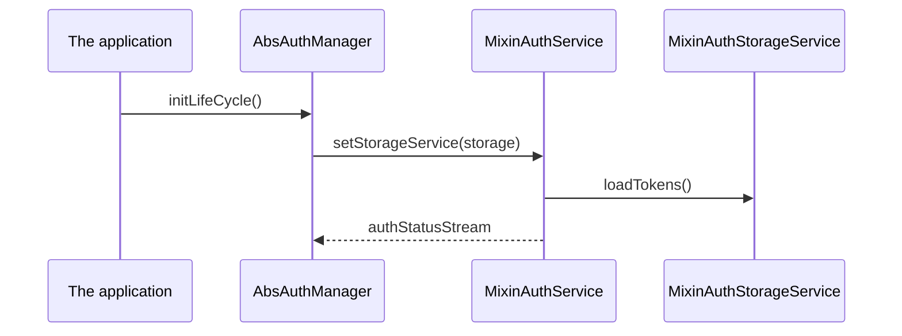

<!--
SPDX-FileCopyrightText: 2024 Benoit Rolandeau <benoit.rolandeau@allcircuits.com>

SPDX-License-Identifier: LicenseRef-ALLCircuits-ACT-1.1
-->

# ACT Shared authentication <!-- omit from toc -->

## Table of contents

- [Table of contents](#table-of-contents)
- [Presentation](#presentation)
- [Architecture](#architecture)
  - [The manager, the service and the storage](#the-manager-the-service-and-the-storage)
  - [What a result says](#what-a-result-says)
  - [The tokens](#the-tokens)
  - [Several providers, one account](#several-providers-one-account)
  - [Following the user](#following-the-user)
- [How to use](#how-to-use)
  - [Installation](#installation)
  - [Write a service](#write-a-service)
  - [Register the manager](#register-the-manager)
  - [Follow the user from elsewhere](#follow-the-user-from-elsewhere)
- [Testing](#testing)

## Presentation

This package is the shape of the authentication of an application: the same methods, the same
results and the same way of keeping the tokens, whichever service actually signs the user in.

It signs nobody in by itself. A third party package implements the service, and the rest of the
application talks to the shape this package defines, so changing the provider changes one package
and not every caller.

An application signs one user in at a time. That is the assumption everything here is built on:
there is one current user, one status, one set of tokens.

## Architecture

### The manager, the service and the storage

`AbsAuthManager` is the manager an application registers. It owns two pieces:

- `MixinAuthService` is what a provider implements: signing up, signing in, resetting a password,
  reading the tokens. Only the sign in, the sign out and the current status are required of it;
  every other method crashes the application when it is called on a service which does not
  implement it, which is a mistake in the application rather than a failure of the provider.
- `MixinAuthStorageService` is what keeps the tokens, and the identifiers of the user when it says
  it can. The manager hands it to the service once, when it is initialized, and the service is the
  one which decides when to read and write, because each provider keeps a different part of the
  data itself.


```mermaid
sequenceDiagram
    participant app as The application
    participant manager as AbsAuthManager
    participant service as MixinAuthService
    participant storage as MixinAuthStorageService

    app->>manager: initLifeCycle()
    manager->>service: setStorageService(storage)
    service->>storage: loadTokens()
    service-->>manager: authStatusStream
```

### What a result says

Every call answers with a result which carries a status and, when there is one, whatever the
provider gave back. A status says three things:

- `isSuccess`, whether the call did what it was asked;
- `isError`, whether something went wrong;
- `userNeedsToAct`, whether the application has to ask the user for something before it goes on.

The three are not the opposite of one another. A sign up which has to be confirmed by a code is a
success and waits for the user; a wrong code is an error and waits for the user too. That is what
lets a page tell "show a form again" from "show an error".

### The tokens

`AuthToken` is one token and the moment it expires, `AuthTokens` is the set an application holds:
the access token, the refresh token and, for the providers which sign in over OAuth, the identity
token. A token which carries nothing is never valid; a token which carries no expiration never
expires; and a caller which only wants to know whether a token exists asks for its validity
without its expiration.

Both read themselves back from the json they wrote, which is how the storage keeps them, and a
token can also be read straight out of a signed JWT, whose expiration is then the one the JWT
carries.

### Several providers, one account

`MixinMultiAuthService` is a service made of other services, one per way of signing in. It is
still one account at a time: the user signs in through one provider, and every call goes to that
one.

Choosing a provider moves the storage from the one the user left to the one they chose, and clears
what the old one kept. That is what keeps a provider from reading the tokens of another.

Before the user has chosen, every call answers with a generic error rather than reaching a
provider at random. An application which offers a single provider has it chosen for it, at the
start.

`SimpleMultiAuthService` is the implementation to use unless an application needs more.

### Following the user

The status of the user is a stream, and there are three ways of following it:

- the manager itself, which overrides `onAuthStatusUpdated`;
- `MixinAuthStatusCallback`, for a class which starts and stops on its own;
- `MixinAuthStatusCallbackOnService`, for a class which has a life cycle, which starts and stops
  with it.

`AuthStreamObserver` is the last one: it turns the status into a validity, true while the user is
signed in, which is what a router or a guard reads.

## How to use

### Installation

Add the package to the `dependencies` of the application:

```yaml
dependencies:
  act_shared_auth:
    path: ../act_shared_auth
```

### Write a service

A service implements what its provider supports, and leaves the rest alone:

```dart
class MyAuthService with MixinAuthService {
  @override
  AuthStatus get authStatus => _status;

  @override
  Stream<AuthStatus> get authStatusStream => _statusCtrl.stream;

  @override
  Future<AuthSignInResult> signInUser({required String username, required String password}) async {
    ...
  }

  @override
  Future<bool> signOut() async => ...;

  @override
  Future<bool> isUserSigned() async => ...;
}
```

### Register the manager

```dart
class MyAuthManager extends AbsAuthManager {
  @override
  Future<MixinAuthService> getAuthService() async => MyAuthService();

  @override
  Future<MixinAuthStorageService?> getStorageService() async => MyAuthStorage();

  @override
  Future<void> onAuthStatusUpdated(AuthStatus status) async {
    ...
  }
}

globalManager.registerManagerAsync<MyAuthManager>(MyAuthBuilder(MyAuthManager.new));
```

### Follow the user from elsewhere

```dart
class MySyncService extends AbsWithLifeCycle
    with MixinAuthStatusCallback<MyAuthManager>, MixinAuthStatusCallbackOnService<MyAuthManager> {
  @override
  Future<void> onAuthStatusUpdated(AuthStatus status) async {
    await super.onAuthStatusUpdated(status);

    ...
  }
}
```

## Testing

The tests drive the manager and the services over a provider which answers what the test decided
and records the calls it received, so the tests read which service a call reached rather than what
a provider would have done with it.

They cover the manager handing the storage to the service and following its status, every call of
the multi provider service reaching the chosen provider, the storage moving from one provider to
another and being cleared on the way, and the generic error every call answers with before a
provider is chosen. The tokens are read back from the json they wrote and from tokens the tests
sign, and the methods a service does not implement are checked to crash the application.

```console
> flutter test
```
