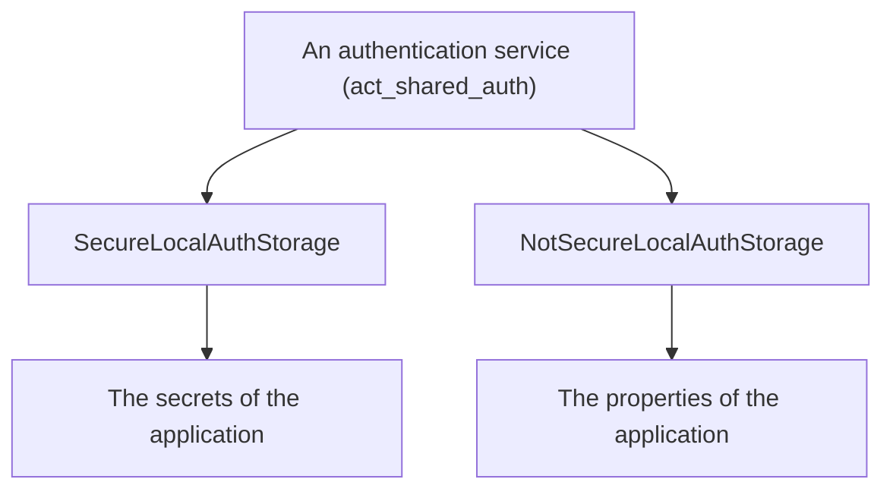

<!--
SPDX-FileCopyrightText: 2024 Benoit Rolandeau <benoit.rolandeau@allcircuits.com>

SPDX-License-Identifier: LicenseRef-ALLCircuits-ACT-1.1
-->

# ACT Shared authentication local storage <!-- omit from toc -->

## Table of contents

- [Table of contents](#table-of-contents)
- [Presentation](#presentation)
- [Architecture](#architecture)
  - [The two storages](#the-two-storages)
  - [What is kept, and where](#what-is-kept-and-where)
  - [The credentials of a user](#the-credentials-of-a-user)
  - [How a value travels](#how-a-value-travels)
- [How to use](#how-to-use)
  - [Installation](#installation)
  - [Declare the values of an application](#declare-the-values-of-an-application)
  - [Hand the storage to the authentication](#hand-the-storage-to-the-authentication)
- [Configuration](#configuration)
- [Testing](#testing)

## Presentation

This package keeps the tokens of a signed in user on the device, so an application which is started
again finds its user signed in. It is the storage of `act_shared_auth` written over
`act_local_storage_manager`.

It comes in two: one which keeps the tokens where the platform keeps its secrets, and one which
keeps them in clear text. Which of the two an application takes is the one decision it has to make
here.

## Architecture

### The two storages



Both are a `MixinAuthStorageService`, which is what an authentication service is handed and reads
the tokens of its user through. They differ in where they write and in what they accept to write:

| Storage                     | Written where                | Keeps the credentials |
| --------------------------- | ---------------------------- | --------------------- |
| `SecureLocalAuthStorage`    | The keychain or the keystore | If the app allows it  |
| `NotSecureLocalAuthStorage` | A clear text file of the app | Never                 |

The one which is not secure is for the applications whose tokens are not worth protecting, or which
run where a keychain is not to be had. Everything it holds is readable by an advanced user or by any
application on a rooted device.

### What is kept, and where

The values are declared as items of the storages of the application, and this package brings the
mixins which declare them:

- `MixinAuthSecrets` adds the tokens and the credentials to the secrets of an application,
- `MixinAuthNotSecuredSecrets` adds the tokens to its properties.

The tokens are written under a key which is not migrated from one device to another, because a
token which was handed to one device is of no use on another one.

### The credentials of a user

Keeping the credentials of a user, the name and the password, is what lets an application sign a
user in again without asking. It is off unless the configuration of the application turns it on, and
only the secure storage does it at all.

Every call which touches them reads that answer first: storing answers false, reading answers
nothing, and clearing does nothing, each of them writing in the logs why. An application which turns
the option off therefore stops reading the credentials which are already on the device rather than
clearing them.

### How a value travels

A storage holds one string per value, and both the tokens and the credentials travel as a json
object which is written as text. Reading gives back nothing when the text is not json, or is json
but not an object, or is an object which carries none of what is expected, and each of those writes
a warning: a value which was written by an older version of an application is a value which cannot
be read, not a crash.

## How to use

### Installation

Add the package to the `dependencies` of your package:

```yaml
dependencies:
  act_shared_auth_local_storage:
    path: ../act_shared_auth_local_storage
```

### Declare the values of an application

An application which keeps its tokens where the platform keeps its secrets:

```dart
class AppConfigManager extends AbstractConfigManager
    with MixinStoresConf, MixinAuthLocalStorageConf {
  AppConfigManager({required super.logger});
}

class AppSecretsManager extends AbstractSecretsManager with MixinAuthSecrets {
  AppSecretsManager({required super.propertiesGetter, required super.confGetter});
}
```

An application which keeps them in clear text:

```dart
class AppPropertiesManager extends AbstractPropertiesManager with MixinAuthNotSecuredSecrets {}
```

### Hand the storage to the authentication

The storages read the managers of the application from the global manager, so they are built once
those are registered:

```dart
final storage = SecureLocalAuthStorage<AppConfigManager, AppSecretsManager>();
await authService.setStorageService(storage);
```

An application which keeps its tokens in clear text builds the other one:

```dart
final storage = NotSecureLocalAuthStorage<AppPropertiesManager>();
```

## Configuration

| Key                                     | Default | What it does                              |
| --------------------------------------- | ------- | ----------------------------------------- |
| `auth.secrets.localStorage.saveUserIds` | `false` | Keeps the name and the password of a user |

The key is only read by the secure storage. Turning it on is what an application does to offer a
sign in which asks nothing of the user; turning it off leaves whatever is already on the device
where it is.

## Testing

The tests write and read through the real items, over the in memory storages the two plugins offer
to a test: what is kept, replaced and forgotten is the real thing, and only the device is stood in
for.

Both storages are covered on the tokens they keep, read back, replace and forget, and on the user
who was never signed in. The secure one is covered on the credentials it keeps and forgets when the
application allows it, and on each of the three calls which do nothing when it does not.

The writing of a value is covered on the tokens and the credentials which are written and read
back, including the tokens of a user who has none, and on the values which cannot be read: the text
which is not json, the json which is not an object, and the object which carries nothing of what is
expected.

```console
> flutter test
```
