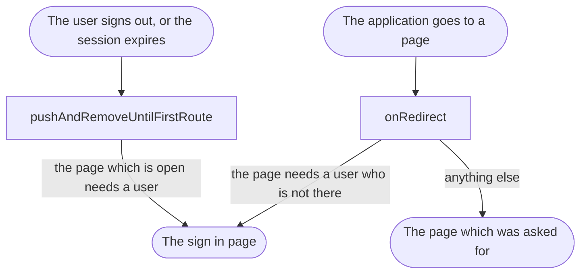

<!--
SPDX-FileCopyrightText: 2024 Benoit Rolandeau <benoit.rolandeau@allcircuits.com>

SPDX-License-Identifier: LicenseRef-ALLCircuits-ACT-1.1
-->

# ACT Shared authentication User Interface  <!-- omit from toc -->

## Table of contents

- [Table of contents](#table-of-contents)
- [Presentation](#presentation)
- [Architecture](#architecture)
  - [The pages which need a signed in user](#the-pages-which-need-a-signed-in-user)
  - [The two moments a user is sent away](#the-two-moments-a-user-is-sent-away)
  - [What a page of the authentication is given](#what-a-page-of-the-authentication-is-given)
- [Guards](#guards)
  - [The terms held by the identity provider](#the-terms-held-by-the-identity-provider)
  - [Stack them](#stack-them)
- [How to use](#how-to-use)
  - [Installation](#installation)
  - [Declare the pages of an application](#declare-the-pages-of-an-application)
  - [Register the redirection](#register-the-redirection)
  - [Go to a page of the authentication](#go-to-a-page-of-the-authentication)
- [Testing](#testing)

## Presentation

This package is the interface side of `act_shared_auth`: it keeps the pages of an application which
need a signed in user away from the ones which do not, and it carries what a page of the
authentication needs to know from the page which sent the user to it.

It draws nothing: the sign in, the sign up and the resetting of a password are pages of the
application. What this package brings is the redirection which sends a user to them, and the models
which travel with the user.

## Architecture

### The pages which need a signed in user

`MixinAuthRoute` is what the routes of an application mix in: one answer per page, saying whether it
needs a signed in user. That answer is read in two places, and nowhere else, so a page which is
added to an application is protected as soon as it is declared.

### The two moments a user is sent away



- when the application goes to a page, the redirection is asked, and it answers the sign in page for
  a page which needs a user who is not signed in. The sign in page itself is always let through, and
  so is a page which needs no user,
- when the status of the user changes while the application is already somewhere, the page which is
  open is the one which is read: a user who signs out or whose session expires while reading a page
  which needs a user is sent to the sign in page, and everything else is forgotten, so that the back
  button does not lead back into the application.

A redirection an application registers before this one has the last word: `onRedirect` reads what
the redirections above it answered first, and the authentication is only asked when they answered
nothing. The order of the mixins is the order of priority.

A router only holds one redirection: registering this one on a router which already has one answers
false and the redirection never starts, which is what an application reads to know that it has to
compose them instead.

### What a page of the authentication is given

Every page of the authentication is given an extra when it is pushed, and they all carry the same
two things: the page to go to once it succeeded, and the error which led the user here, of the type
that page answers.

| The extra                 | What it adds                                                 |
| ------------------------- | ------------------------------------------------------------ |
| `SignInPageExtra`         | Nothing more                                                 |
| `SignUpPageExtra`         | The account and the password a form is filled from           |
| `ConfirmSignUpPageExtra`  | The same, with the account which cannot be left out          |
| `ResetPwdPageExtra`       | The user, and the code it read when it has one               |

The account and the password of a sign up are what lets a user who was refused on the sign in page
find a form which is already filled, and the account of a confirmation is what the code is checked
against, which is why that one is mandatory.

## Guards

A guard is a mixin on `MixinRedirectService`: it reads what the guards written before it answered,
and only imposes a page of its own when they answered nothing. The order of the mixins is the order
of priority, and this package brings two of them.

- `MixinAuthRedirectService` imposes the sign in page on a user who is not signed in, and reads
  `isAuthNeeded` of the route,
- `MixinTermsRedirectService` imposes the terms page on an acceptance which is too old, and reads
  `needsAcceptedTerms` of the route.

The authentication comes first: the acceptance of the terms is read from the session, so there is
nothing to read as long as the user is not signed in.

### The terms held by the identity provider

`MixinTermsRedirectService` fits the applications whose terms are accepted outside of them, on the
identity provider: the date it happened is copied into the access token as a claim, and the date of
the text in force is what the application answers. An acceptance older than the text in force is not
an acceptance of that text, so publishing a new date is what asks every user again. The consents an
application shows and signs itself are another need, and
[`act_consent_manager`](../act_consent_manager/) models those.

The guard imposes the terms page at two moments, the same two as the authentication: when the
application goes to a page which needs accepted terms, and when the user signs in while such a page
is already open.

Nothing is imposed when anything is missing — no signed in user, an authentication service which
doesn't mix `MixinRawIdpTokenProvider` in, no token, or no publication date. Locking every user out
of the application is a worse answer than asking them again at their next sign in.

### Stack them

```dart
enum AppRoute with MixinRoute, MixinAuthRoute, MixinTermsRoute {
  signIn(isAuthNeeded: false, needsAcceptedTerms: false),
  terms(isAuthNeeded: true, needsAcceptedTerms: false),
  home(isAuthNeeded: true, needsAcceptedTerms: true);

  @override
  final bool isAuthNeeded;

  @override
  final bool needsAcceptedTerms;

  const AppRoute({required this.isAuthNeeded, required this.needsAcceptedTerms});
}

class AppRedirectService
    with
        MixinRedirectService<AppRoute>,
        MixinAuthRedirectService<AppRoute>,
        MixinTermsRedirectService<AppRoute> {
  @override
  AbstractRouterManager<AppRoute> getRouterManagerFromGlobal() =>
      globalGetIt().get<AppRouterManager>();

  @override
  AbsAuthManager getAuthenticationManagerFromGlobal() => globalGetIt().get<AppAuthManager>();

  @override
  AppRoute getSignInPage() => AppRoute.signIn;

  @override
  AppRoute getTermsRoute() => AppRoute.terms;

  @override
  DateTime? getTermsPublishedAt() =>
      DateTime.tryParse(globalGetIt().get<AppConfigManager>().termsPublishedAt.load() ?? "");
}
```

The terms page answers false to `needsAcceptedTerms`, otherwise the guard would impose it over and
over. Both guards ask for the authentication manager through the same hook, so an application writes
that one once.

Where the publication date comes from is left to the application. `MixinLegalConf` reads it from the
configuration, next to the base URL of the published legal pages:

```dart
class AppConfigManager extends AbstractConfigManager with MixinLegalConf {}
```

## How to use

### Installation

Add the package to the `dependencies` of your package:

```yaml
dependencies:
  act_shared_auth_ui:
    path: ../act_shared_auth_ui
```

### Declare the pages of an application

```dart
enum AppRoute with MixinRoute, MixinAuthRoute {
  signIn(isAuthNeeded: false),
  signUp(isAuthNeeded: false),
  home(isAuthNeeded: true);

  @override
  final bool isAuthNeeded;

  const AppRoute({required this.isAuthNeeded});
}
```

### Register the redirection

```dart
class AppRedirectService with MixinRedirectService<AppRoute>, MixinAuthRedirectService<AppRoute> {
  @override
  AbstractRouterManager<AppRoute> getRouterManagerFromGlobal() =>
      globalGetIt().get<AppRouterManager>();

  @override
  AbsAuthManager getAuthenticationManagerFromGlobal() => globalGetIt().get<AppAuthManager>();

  @override
  AppRoute getSignInPage() => AppRoute.signIn;
}
```

The service is initialized once the router and the authentication of the application are, and it is
closed with them:

```dart
if (!await redirectService.initRedirectService()) {
  // Another redirection is already registered on the router
}
```

### Go to a page of the authentication

```dart
routerManager.push(
  AppRoute.signUp,
  extra: SignUpPageExtra<AppRoute>(
    accountId: username,
    password: password,
    nextRouteWhenSuccess: AppRoute.home,
    previousError: AuthSignInStatus.userNotFound,
  ),
);
```

A page reads its extra the way it reads any other one:

```dart
final extra = checkAndCastExtra<SignUpPageExtra<AppRoute>>(state);
```

## Testing

The tests drive the redirection over a router which records where it was asked to go and an
authentication which answers the status the test decided: a real router needs a view to push a page
into, and what is covered here is what the redirection answers around it.

The redirection is covered on the signed in user which is let through, the signed out user which is
sent to the sign in page, the pages which need no user, the sign in page itself, and the page a
redirection of the application asked for before it. The status of the user is covered on the sign
out and the session which expires while a page which needs a user is open, on the same while a page
which needs none is open, on the user who signs in, and on the status which did not change.

The registering is covered on the router which already has a redirection of its own, which stops the
service before it starts, and on the closing of a service which never started. The extras are
covered on what each of them carries and on what tells two of them apart.

The terms guard is covered the same way, over an authentication which hands out a token a test
built: the acceptance which is too old and the one which is up to date, on a navigation and on the
user who signs in, the page which needs no accepted terms and the terms page itself, and the four
ways it fails open, which are the user who is not signed in, the service which hands out no raw
token, the session without a token and the publication date which is unknown. The reading of the
claim and the comparison of the two dates are covered on their own, tokens and all.

```console
> flutter test
```
