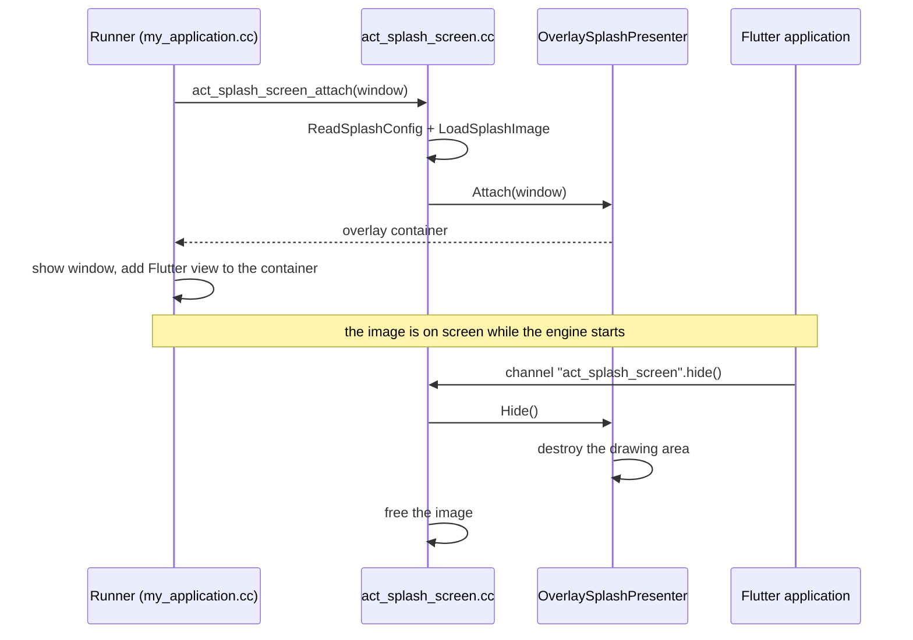

<!--
SPDX-FileCopyrightText: 2026 Benoit Rolandeau <benoit.rolandeau@allcircuits.com>

SPDX-License-Identifier: LicenseRef-ALLCircuits-ACT-1.1
-->

# ACT Splash screen - Linux  <!-- omit from toc -->

The native part which draws the splash screen of a Linux application, with GTK and Cairo. Read the
[package README](../README.md) first: it says what the splash screen is for and how the Dart side
uses it. This page is about the C++ under `linux/`, for whoever changes it or wires it into a
runner.

## Table of contents

- [Table of contents](#table-of-contents)
- [What this part does](#what-this-part-does)
- [The pieces](#the-pieces)
- [The life of the splash screen](#the-life-of-the-splash-screen)
- [How the image is drawn](#how-the-image-is-drawn)
- [Finding the assets](#finding-the-assets)
- [How to support a new way of displaying it](#how-to-support-a-new-way-of-displaying-it)
- [Building and testing](#building-and-testing)

## What this part does

A Linux application draws no splash screen of its own. Its runner creates a window, and that window
stays empty until Flutter paints in it, which is well after the process has started. This part
fills that window with an image from the first moment, and removes it when the application says it
is ready.

The image is drawn **in the window of the application**, over the Flutter view and under nothing
else. There is one window, which suits an application displayed full screen with no window manager
to arrange anything.

The runner drives everything: it displays the splash screen before the engine is started, and the
application removes it later through a method channel. Between the two, this part owns the image and
the widget it is drawn on.

## The pieces

The code shared with Windows lives one directory up, in `common/`; the rest is here.

| File                                          | Role                                                                                             |
| --------------------------------------------- | ------------------------------------------------------------------------------------------------ |
| `../common/splash_config.{h,cc}`              | what a splash screen is, and the parser of its configuration file; no platform                   |
| `splash_config_reader.{h,cc}`                 | finds the asset directory and hands the configuration text to the shared parser                  |
| `splash_image_loader.{h,cc}`                  | reads the image file into a `GdkPixbuf`                                                          |
| `splash_presenter.h`                          | the interface a splash screen is displayed and removed through                                   |
| `overlay_splash_presenter.{h,cc}`             | the presenter which draws in the window of the application                                       |
| `include/.../act_splash_screen.h` + `.cc`     | the C entry points the runner calls: `attach` and `hide`                                         |
| `act_splash_screen_manager_plugin.cc` | the Flutter plugin, which turns the `hide` call of the application into `act_splash_screen_hide` |
| `CMakeLists.txt`                              | builds the plugin, and the shared unit tests when the example asks for them                      |

`act_splash_screen.cc` holds the one presenter of the process in a function-local static: the
application has a single window and a single splash screen, created before anything else exists, so
there is nothing to hang it on but the process itself.

## The life of the splash screen



`act_splash_screen_attach` reads the configuration and the image before the window is shown. When
either is missing it returns the window unchanged, so a runner which always calls it works whether
the application bundles a splash screen or not. When both are there, it builds an
`OverlaySplashPresenter` and returns the container the Flutter view has to be added to.

The application removes the splash screen by itself, through `DesktopSplashScreenManager`, which
calls `hide` on the `act_splash_screen` channel once the first view is built. The plugin turns that
call into `act_splash_screen_hide`, which destroys the drawing area and frees the image. An
application which starts on a small board is glad to have that memory back.

## How the image is drawn

`OverlaySplashPresenter::attach` adds a `GtkOverlay` to the window and a `GtkDrawingArea` on top of
it. The Flutter view goes into the overlay underneath; the drawing area covers it until it is
destroyed. The drawing area is painted by `draw`, called by GTK through the `draw` signal whenever
the area has to be repainted, so the image follows the window as it is sized.

`draw` paints the background colour, then the image scaled with Cairo. `cover` scales by the larger
of the two ratios so the image fills the area and the overflow is cut; `contain` scales by the
smaller so the whole image is seen and the background shows around it. The image is centred either
way.

## Finding the assets

The runner draws before the engine exists, so it cannot ask Flutter where anything is. `bundle`
puts the assets next to the executable, under `data/flutter_assets`, and `AssetDirectory` resolves
that from the path of the running executable, read through `/proc/self/exe`. The image path and the
configuration name are then relative to that directory, and the image path is the very one the
application gives to Flutter.

## How to support a new way of displaying it

An application which wants the splash screen in a window of its own, the way desktop applications
used to, needs another `ASplashPresenter`. Implement `attach` and `hide`, and have
`act_splash_screen_attach` build it instead of `OverlaySplashPresenter`. Neither the application
nor the Dart side sees the difference: the interface is the whole contract, and the choice is made
here, in the native code the runner links against.

## Building and testing

The plugin is built by the Flutter tooling as part of the application; there is nothing to build by
hand. The unit tests cover the shared parser in `../common`, and are described in the
[Testing section of the package README](../README.md#testing). In short:

```console
> ACT_SPLASH_BUILD_TESTS=1 flutter build linux --debug
> build/linux/x64/debug/plugins/act_splash_screen_manager/act_splash_screen_manager_test
```

The first command builds the example and, because of the environment variable, the test binary; the
second runs it.
