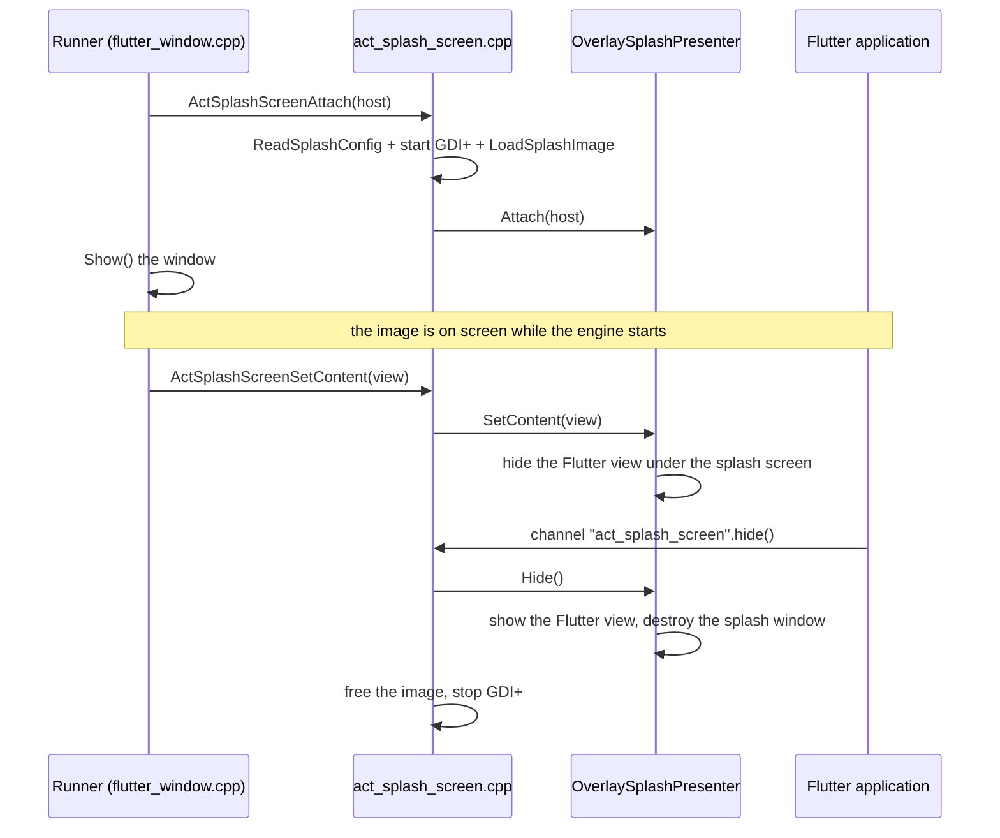

<!--
SPDX-FileCopyrightText: 2026 Benoit Rolandeau <benoit.rolandeau@allcircuits.com>

SPDX-License-Identifier: LicenseRef-ALLCircuits-ACT-1.1
-->

# ACT Splash screen - Windows  <!-- omit from toc -->

The native part which draws the splash screen of a Windows application, with Win32 and GDI+. Read
the [package README](../README.md) first: it says what the splash screen is for and how the Dart
side uses it. This page is about the C++ under `windows/`, for whoever changes it or wires it into a
runner.

## Table of contents

- [Table of contents](#table-of-contents)
- [What this part does](#what-this-part-does)
- [The pieces](#the-pieces)
- [The life of the splash screen](#the-life-of-the-splash-screen)
- [How the image is drawn](#how-the-image-is-drawn)
- [The drawing library](#the-drawing-library)
- [Finding the assets](#finding-the-assets)
- [How to support a new way of displaying it](#how-to-support-a-new-way-of-displaying-it)
- [Building and testing](#building-and-testing)

## What this part does

A Windows application draws no splash screen of its own. Its runner creates a window, and that
window stays empty until Flutter paints in it, which is well after the process has started. This
part fills that window with an image from the first moment, and removes it when the application says
it is ready.

The image is drawn **in the window of the application**, over the Flutter view. There is one
window, which suits an application displayed full screen with no window manager to arrange anything.

The runner drives everything: it displays the splash screen before the engine is started, tells it
which window it covers once the Flutter view exists, and the application removes it later through a
method channel. Between the two, this part owns the image and the window it is drawn in.

## The pieces

The code shared with Linux lives one directory up, in `common/`; the rest is here.

| File                                               | Role                                                                                          |
| -------------------------------------------------- | --------------------------------------------------------------------------------------------- |
| `../common/splash_config.{h,cc}`                   | what a splash screen is, and the parser of its configuration file; no platform                |
| `splash_config_reader.{h,cpp}`                     | finds the asset directory and hands the configuration text to the shared parser               |
| `splash_image_loader.{h,cpp}`                      | reads the image file into a GDI+ `Image`                                                      |
| `splash_presenter.h`                               | the interface a splash screen is displayed and removed through                                |
| `overlay_splash_presenter.{h,cpp}`                 | the presenter which draws in the window of the application                                    |
| `include/.../act_splash_screen.h` + `.cpp`         | the C entry points the runner calls: `attach`, `set content` and `hide`                       |
| `act_splash_screen_manager_plugin.{h,cpp}` | the Flutter plugin, which turns the `hide` call of the application into `ActSplashScreenHide` |
| `..._plugin_c_api.{h,cpp}`                         | the C shim the Flutter tooling registers the plugin through                                   |
| `CMakeLists.txt`                                   | builds the plugin, and the shared unit tests when the example asks for them                   |

`act_splash_screen.cpp` holds the one presenter of the process, and the GDI+ token, in
function-local statics: the application has a single window and a single splash screen, created
before anything else exists, so there is nothing to hang them on but the process itself.

## The life of the splash screen



Windows differs from Linux in one point: the splash screen is a child window drawn over the Flutter
view, not an overlay the view is added into. The runner therefore hands the two windows over in two
steps. `ActSplashScreenAttach` creates the splash window over the host as soon as the host exists;
`ActSplashScreenSetContent` is called once the Flutter view exists, and hides that view until the
splash screen is removed. Without the second call the splash window would still cover the view, but
the view would repaint underneath and be seen the moment the splash window went away.

When the configuration or the image is missing, `ActSplashScreenAttach` draws nothing and the
runner starts as before. The application removes the splash screen by itself, through
`DesktopSplashScreenManager`, which calls `hide` on the `act_splash_screen` channel once the first
view is built. The plugin turns that call into `ActSplashScreenHide`, which shows the Flutter view
again, destroys the splash window, and frees the image.

## How the image is drawn

`OverlaySplashPresenter::attach` registers a window class once for the process and creates a child
window filling the host. That window answers `WM_PAINT` through `draw`, and `WM_ERASEBKGND` with a
non-zero result: the whole surface is painted, so erasing it first would only make it blink.

`draw` fills the background colour with a solid brush, then draws the image scaled with GDI+.
`cover` scales by the larger of the two ratios so the image fills the window and the overflow is
cut; `contain` scales by the smaller so the whole image is seen and the background shows around it.
The image is centred either way, and drawn with high-quality bicubic interpolation.

## The drawing library

GDI+ has to be started before an `Image` is created and stopped after the last one is freed. The
token is started in `ActSplashScreenAttach`, right before the image is loaded, and
`GdiplusShutdown` is called in `ActSplashScreenHide`, after the presenter and its image are gone. A
startup which fails before the image is loaded stops GDI+ again straight away, so the library is
never left running with nothing to draw.

## Finding the assets

The runner draws before the engine exists, so it cannot ask Flutter where anything is. `bundle`
puts the assets next to the executable, under `data\flutter_assets`, and `AssetDirectory` resolves
that from the path of the running executable, read through `GetModuleFileNameW`. The paths in the
configuration are written with forward slashes, as the application gives them to Flutter, so
`PlatformPath` turns them into backslash paths before they are opened.

## How to support a new way of displaying it

An application which wants the splash screen in a window of its own, the way desktop applications
used to, needs another `ASplashPresenter`. Implement `attach`, `setContent` and `hide`, and have
`ActSplashScreenAttach` build it instead of `OverlaySplashPresenter`. Neither the application nor
the Dart side sees the difference: the interface is the whole contract, and the choice is made here,
in the native code the runner links against.

## Building and testing

The plugin is built by the Flutter tooling as part of the application; there is nothing to build by
hand. The unit tests cover the shared parser in `../common`, and are described in the
[Testing section of the package README](../README.md#testing). In short:

```console
> $env:ACT_SPLASH_BUILD_TESTS = "1"
> flutter build windows --debug
> build\windows\x64\plugins\act_splash_screen_manager\Debug\act_splash_screen_manager_test.exe
```

The first line asks for the test binary, the second builds the example and the tests, and the third
runs them.
