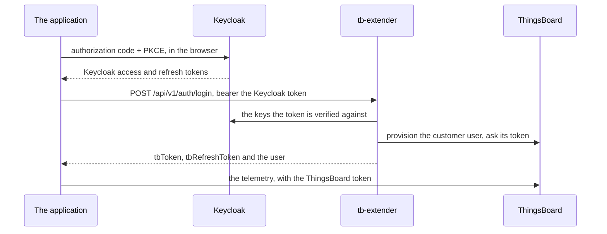

<!--
SPDX-FileCopyrightText: 2026 Dorian Benech <dorian.benech@allcircuits.com>

SPDX-License-Identifier: LicenseRef-ALLCircuits-ACT-1.1
-->

# ACT tb-extender authentication <!-- omit from toc -->

## Table of contents <!-- omit from toc -->

- [Presentation](#presentation)
- [Architecture](#architecture)
  - [The sign in](#the-sign-in)
  - [The refresh ladder](#the-refresh-ladder)
  - [The deletion of an account](#the-deletion-of-an-account)
- [How to use](#how-to-use)
  - [Installation](#installation)
  - [Declare the configuration and the secrets](#declare-the-configuration-and-the-secrets)
  - [Build the service](#build-the-service)
- [Configuration](#configuration)
- [What this package does not know](#what-this-package-does-not-know)
- [Testing](#testing)

## Presentation

ThingsBoard validates no token but its own: it speaks neither PKCE nor the exchange of an external
OIDC token. An application whose users sign in with Keycloak and whose data lives in ThingsBoard
therefore holds two sets of tokens, and something has to turn the first into the second. That
something is the `tb-extender` broker, which reads a Keycloak access token, provisions the
ThingsBoard customer user behind it and answers a pair of ThingsBoard tokens.

This package is the side of that contract an application runs: the client which speaks to the
broker, the errors it answers, and the authentication service which holds the two sets of tokens
and keeps them alive. It knows nothing of any product: the realm, the broker and the ThingsBoard
server are all named by the configuration of the application.

## Architecture

`act_oauth2_keycloak` signs the user in and owns the Keycloak tokens, `TbExtenderBrokerClient`
speaks the two endpoints of the broker, and `KeycloakTbAuthService` is the `MixinAuthService` the
rest of an application talks to. What it answers through `getTokens` is the ThingsBoard pair, so
everything built on `act_thingsboard_client` keeps working untouched; the Keycloak pair is only
ever read to call the broker, and to hand out the raw token of the identity provider through
`MixinRawIdpTokenProvider`.

### The sign in



The broker holds no state of its own, which is what makes the second half of the ladder below
possible: calling `/login` again with a fresh Keycloak token is the very same call the sign in
made.

### The refresh ladder

`getTokens` climbs four steps and stops at the first which answers:

1. The ThingsBoard access token held in memory, when it is still valid.
2. A refresh against ThingsBoard itself, with the ThingsBoard refresh token.
3. A refresh of the Keycloak token, followed by a new login at the broker.
4. Nothing left to refresh with: the status becomes `sessionExpired` and `null` is answered.

The first two steps are what the day of a signed in user is made of, and neither of them reaches
Keycloak. The third is the one which survives a ThingsBoard refresh token that expired or was
refused, and it costs the user nothing as long as the Keycloak session is alive.

### The deletion of an account

`deleteAccount` asks the broker to erase the ThingsBoard customer, the telemetry of its devices and
the Keycloak identity, then signs the user out. The sign out is deliberately called outside of the
mutex which guards the deletion, because it takes the same one, and it only runs once the account
is gone: at that point the tokens in hand point at nothing.

## How to use

### Installation

Add the package to the `dependencies` of your package:

```yaml
dependencies:
  act_tb_extender_auth:
    path: ../act_tb_extender_auth
```

### Declare the configuration and the secrets

The configuration manager of the application names the three sides of its authentication, and its
secrets manager the second set of tokens:

```dart
class AppConfigManager extends AbstractConfigManager
    with MixinStoresConf, MixinKeycloakOAuth2Conf, MixinAuthLocalStorageConf, MixinTbExtenderConf {}

class AppSecretsManager extends AbstractSecretsManager with MixinAuthSecrets, MixinKeycloakAuthSecrets {
  AppSecretsManager({required super.propertiesGetter, required super.confGetter});
}
```

`MixinAuthSecrets` keeps the ThingsBoard tokens under `AUTH_TOKENS`, and `MixinKeycloakAuthSecrets`
adds the Keycloak ones under `KC_AUTH_TOKENS`.

### Build the service

```dart
class AppAuthManager extends AbsAuthManager {
  @override
  Future<MixinAuthService> getAuthService() async {
    final service = const KeycloakTbAuthServiceBuilder<AppConfigManager, AppSecretsManager>().build(
      redirectUrl: "com.example.app://oauth2redirect",
      onSignOut: () => globalGetIt().get<AppPropertiesManager>().forgetPairedDevice(),
    );
    await service.initLifeCycle();

    return service;
  }

  @override
  Future<MixinAuthStorageService?> getStorageService() async =>
      SecureLocalAuthStorage<AppConfigManager, AppSecretsManager>();
}
```

The storage the manager answers is where the ThingsBoard tokens are kept; the Keycloak ones are
kept by a second storage the builder hands the provider. The builder reads the configuration
manager, the secrets manager and the `TbNoAuthServerReqManager` out of the service locator, so the
builder of the authentication manager names the three in its `dependsOn`.

The `redirectUrl` is the URI registered on the Keycloak client, and `postLogoutRedirectUrl` is only
given when the realm registered another one for the sign out. `onSignOut` is what the application
forgets the account which is leaving with.

## Configuration

| Key                | Type   | What it is                                               |
| ------------------ | ------ | -------------------------------------------------------- |
| `auth.broker.url`  | String | The base URL of the tb-extender tenant of the application |

A deployment of the broker serves a list of tenants, each one on its own port, with its own realm
and its own ThingsBoard tenant: this URL is the one of the tenant of the application, and a token
minted for one is useless on another.

The keys of the Keycloak realm itself, `auth.oauth2.keycloak.config.*`, belong to
[`act_oauth2_keycloak`](../act_oauth2_keycloak/), and the one of the local storage,
`auth.secrets.localStorage.saveUserIds`, to
[`act_shared_auth_local_storage`](../act_shared_auth_local_storage/).

## What this package does not know

Nothing of the application it is used by: no route and no page. Where the user is sent when the
session expires, and what is shown when the broker answers that an email isn't verified, are the
business of the application; this package only answers a typed status and the `BrokerAuthError`
behind it.

What an application forgets when a session ends isn't here either: a paired device, a cache or a
dashboard belongs to the account which is leaving, and the `onSignOut` callback is where the
application drops it.

The redirect scheme isn't here either. It is declared by the application, in the Android manifest
placeholder and in the URL types of the iOS `Info.plist`, and the URL built on it is given to the
builder.

## Testing

The broker client is covered over a stubbed transport, on the two endpoints, on the trailing slash
of the base URL, on a base URL which was never configured, on every documented error code and on
the transport failures which never reach the broker. The parsing of the payload is covered there
too, on a body which isn't a JSON object, on one which misses a mandatory field and on one which
names no first and last name.

The service is covered against a fake provider and a fake broker, which is where it already draws
its boundary: the sign in and what each answer of the broker is read as, the four steps of the
refresh ladder one by one, the sign out and what the application is told of it, and the deletion of
an account, which the test names as happening outside of the mutex because a service which called
the sign out from inside would hang there rather than fail.

What is out of reach is the builder: it exists to read the managers of an application out of the
service locator, so covering it would mean standing up a ThingsBoard request manager and a secure
storage to watch it hand five collaborators over. The two mixins it reads are covered instead, the
configuration through a real configuration manager over the file it serves, and the secret item on
the key which keeps the Keycloak tokens apart from the ThingsBoard ones.

```console
> flutter test
```
