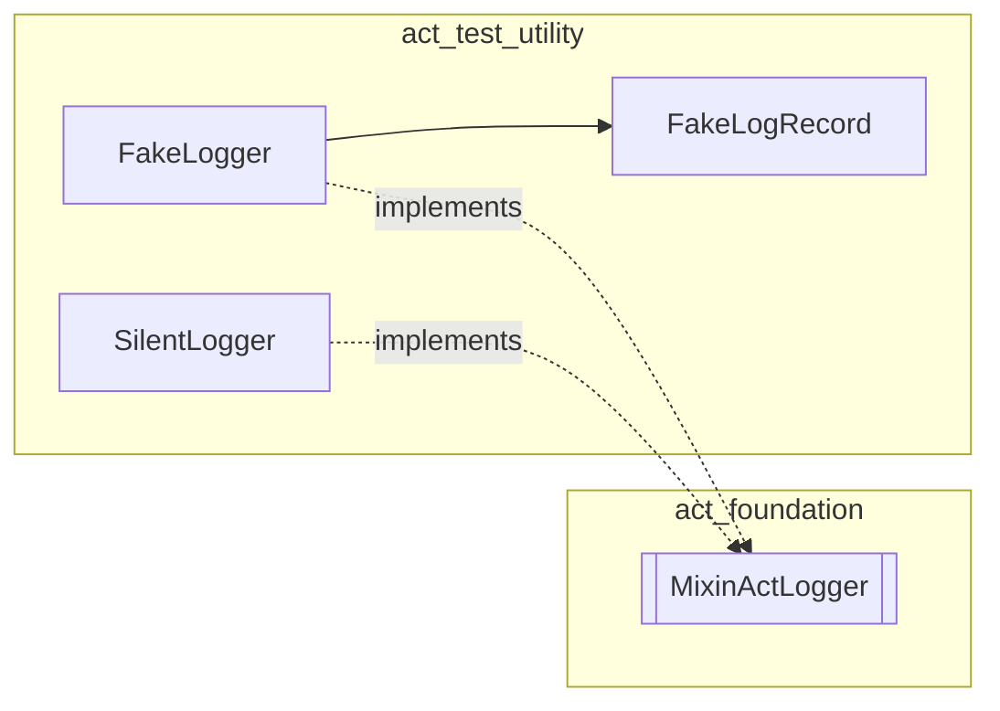

<!--
SPDX-FileCopyrightText: 2026 Benoit Rolandeau <benoit.rolandeau@allcircuits.com>

SPDX-License-Identifier: LicenseRef-ALLCircuits-ACT-1.1
-->

# ACT Test utility <!-- omit from toc -->

## Table of contents

- [Table of contents](#table-of-contents)
- [Presentation](#presentation)
- [Architecture](#architecture)
- [How to use](#how-to-use)
  - [Installation](#installation)
  - [Assert on what was logged](#assert-on-what-was-logged)
  - [Silence the logs of a class under test](#silence-the-logs-of-a-class-under-test)
  - [Serve the assets a test needs](#serve-the-assets-a-test-needs)
  - [Give the class under test a global manager](#give-the-class-under-test-a-global-manager)
- [Testing](#testing)

## Presentation

This package contains the fakes and the helpers shared by the unit tests of the ACT packages. It
exists so that the same fake is written once instead of being copied in every package which needs
it.

It is only meant to be added as a `dev_dependency`: nothing here is intended to run in an
application. It contains no test of its own for the other packages either; it only provides the
tools they use to write theirs.

A package which this one depends on cannot use it, because that would create a dependency cycle.
Such a package defines its fakes locally, in its own `test/` folder.

## Architecture

The package is organised by the kind of element it provides:

- `lib/src/fakes/` contains the fake implementations of the ACT interfaces,
- `lib/src/models/` contains the data classes those fakes expose to the tests.

Two implementations of the `MixinActLogger` interface of `act_foundation` are available, and the
choice between them depends on what the test asserts:

| Class          | Behaviour                                  | Use it when                         |
| -------------- | ------------------------------------------ | ----------------------------------- |
| `FakeLogger`   | Records every message as a `FakeLogRecord` | The test asserts on what was logged |
| `SilentLogger` | Drops every message and records nothing    | The logs are not part of the test   |

A `FakeLogger` behaves like a real logger helper: it owns a list of categories, an optional minimum
level below which the messages are dropped, and a default level used when the level of a message is
unknown. The sub loggers it creates append their sub category to the categories of their parent and
share its records, so a test can assert from the root logger on a message logged deep in the class
under test.



`FakeGlobalManager` is the global manager of the application in a test. A class which reaches its
logger or its managers through the shortcuts of `act_global_manager` needs one to exist, and this
manager gives the test one which holds only what the test registers.

`FakeAssets` serves the files a test needs in place of the ones of the application bundle. It
answers on the platform channel the asset bundle reads through, so the class under test keeps
loading its assets the way it does in an application, and it also empties the cache of the bundle,
which otherwise keeps the files of the previous test.

## How to use

### Installation

Add the package to the `dev_dependencies` of the package to test:

```yaml
dev_dependencies:
  act_test_utility:
    path: ../act_test_utility
```

### Assert on what was logged

Give a `FakeLogger` to the class under test, then read its records:

```dart
test("logs a warning when the value is out of range", () {
  final logger = FakeLogger(category: "myManager");
  final manager = MyManager(logger: logger);

  manager.setValue(-1);

  expect(logger.recordsAtLevel(LogsLevel.warn).length, 1);
});
```

`records` returns every message in the order they were logged, `recordsAtLevel` keeps only the
messages of a given level, and `clearRecords` forgets them all, which is useful to isolate the
messages of a single step in a test which has several ones.

A `FakeLogRecord` has a value equality, so a whole record can be compared at once instead of
asserting on its fields one by one:

```dart
expect(logger.records, [
  const FakeLogRecord(categories: ["myManager"], level: LogsLevel.warn, message: "value: -1"),
]);
```

A minimum level makes the fake drop the messages a real logger would not write:

```dart
final logger = FakeLogger(minLevel: LogsLevel.warn);
```

### Silence the logs of a class under test

When the test does not care about the logs, use the silent logger. It is constant, so it can be
shared without any set up or tear down:

```dart
final manager = MyManager(logger: const SilentLogger());
```

### Serve the assets a test needs

Give the contents to serve, keyed by asset key, and stop serving them once the test is over:

```dart
void main() {
  TestWidgetsFlutterBinding.ensureInitialized();

  tearDown(FakeAssets.stop);

  test("reads the level from its configuration file", () async {
    FakeAssets.serve({"assets/config/default.yaml": "logs:\n  level: warning"});

    final manager = MyConfigManager(logger: const SilentLogger());
    await manager.initLifeCycle();

    expect(manager.logLevelEnv.load(), LogsLevel.warn);
  });
}
```

A key which is not served is reported as missing, exactly as a file absent from the bundle is, so a
test can check what a class does without its optional files.

### Give the class under test a global manager

Install the manager before the class under test is built, and forget the managers it holds once the
test is over:

```dart
void main() {
  late FakeGlobalManager globalManager;

  setUp(() => globalManager = FakeGlobalManager.install());
  tearDown(() => globalManager.reset());

  test("logs a warning when the packet is empty", () {
    final logger = FakeLogger();
    globalManager = FakeGlobalManager.install(logger: logger);

    MyParser.parse(Uint8List(0));

    expect(logger.recordsAtLevel(LogsLevel.warn).length, 1);
  });
}
```

Without a logger, the manager is silent, which is what a test which only needs the shortcuts to
answer wants. The managers a test needs are registered on it the way an application registers
them:

```dart
globalManager.register(MyManagerBuilder());
await globalManager.allReady();
```

## Testing

The tests cover the recording of the messages, the propagation of the categories and of the records
to the sub loggers, the filtering done by the minimum level, the contents served, replaced and
stopped by the fake assets, and the installation, the logger and the managers of the fake global
manager. To run them:

```console
> flutter test
```
