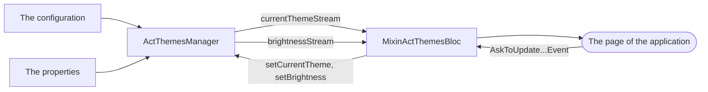

<!--
SPDX-FileCopyrightText: 2026 Benoit Rolandeau <benoit.rolandeau@allcircuits.com>

SPDX-License-Identifier: LicenseRef-ALLCircuits-ACT-1.1
-->

# ACT Themes manager  <!-- omit from toc -->

## Table of contents

- [Table of contents](#table-of-contents)
- [Presentation](#presentation)
- [Architecture](#architecture)
  - [The theme and the brightness](#the-theme-and-the-brightness)
  - [What the manager starts with](#what-the-manager-starts-with)
  - [The theme data of a theme](#the-theme-data-of-a-theme)
  - [The bloc of a page](#the-bloc-of-a-page)
- [How to use](#how-to-use)
  - [Installation](#installation)
  - [Declare the themes of an application](#declare-the-themes-of-an-application)
  - [Register the manager](#register-the-manager)
  - [Show the theme in the application](#show-the-theme-in-the-application)
  - [Let the user choose](#let-the-user-choose)
- [Configuration](#configuration)
- [Testing](#testing)

## Presentation

This package holds the theme an application is painted with. It keeps two answers apart: which
theme the user chose, and whether it is shown light or dark. Both are remembered between two runs,
and both can be forced from the configuration while the application is being developed.

It decides nothing about what a theme looks like: the colors, the fonts and the extensions belong
to the application, which declares them once per theme.

## Architecture

### The theme and the brightness



The manager holds the two values and pushes every change on a stream. A brightness which is null
means that the application follows the device, which is not the same as a brightness which is light.

A theme the application does not know is refused rather than kept, so that what the manager holds
is always one of the themes which were declared.

### What the manager starts with

The theme of the start is read in this order:

1. the theme of the configuration, when it is named and when the application runs in development
   with `themes.dev.force` set,
2. the theme the user chose the last time,
3. the theme of the configuration,
4. the first theme of the application, which is also what an unknown name falls back to.

The brightness follows the same idea with one step less: `themes.dev.forceLightModeValue` wins in
development, then the brightness the user chose, and otherwise the application follows the device.

Forcing from the configuration is what makes a theme readable while it is being written: the
developer changes one line rather than clearing the storage of the device at every run.

### The theme data of a theme

`ActThemeModel` builds the Material theme data of a theme, one for the light brightness and one for
the dark one. A theme which only has one of the two is built with that one alone; a theme which has
neither is refused.

Each is built from an `ActThemeColors`, which carries the color scheme and, if the application has
colors of its own, the `AbsAppSpecificColors` extension they travel in. The application can then
step in twice: `overrideDefaultTextTheme` writes the text theme, and `overrideDefaultThemeData`
changes anything else. The second is called with the theme data the first wrote.

### The bloc of a page

`MixinActThemesBloc` is what a page mixes into its bloc to follow the themes, and
`MixinActThemesState` what its state mixes in to carry them. The bloc listens to the two streams of
the manager, and the two events a page sends it go the other way: the bloc asks the manager, the
manager pushes on its stream, and the state is built from what came back.

The state also turns the brightness into the `ThemeMode` a `MaterialApp` reads: light, dark, or the
one of the system when the application follows the device.

## How to use

### Installation

Add the package to the `dependencies` of your package:

```yaml
dependencies:
  act_themes_manager:
    path: ../act_themes_manager
```

### Declare the themes of an application

```dart
enum AppThemes with MixinStringValueType, MixinActThemes {
  ocean,
  forest;

  @override
  ActThemeModel get themeData => ActThemeModel<AppColors>(
        lightColors: ActThemeColors<AppColors>(
          colorScheme: ColorScheme.fromSeed(seedColor: Colors.blue),
          colorExtensions: const AppColors(highlight: Colors.amber),
        ),
        darkColors: ActThemeColors<AppColors>(
          colorScheme: ColorScheme.fromSeed(seedColor: Colors.blue, brightness: Brightness.dark),
        ),
        fontFamily: "Roboto",
      );
}
```

The colors an application adds to the ones of a color scheme are declared once:

```dart
class AppColors extends AbsAppSpecificColors<AppColors> {
  final Color highlight;

  const AppColors({required this.highlight});

  @override
  AppColors copyWith({Color? highlight}) => AppColors(highlight: highlight ?? this.highlight);

  @override
  AppColors lerp(AppColors? other, double t) =>
      other == null ? this : AppColors(highlight: Color.lerp(highlight, other.highlight, t)!);
}
```

The configuration manager and the properties manager of the application carry the values this
package reads:

```dart
class AppConfigManager extends AbstractConfigManager with MixinThemesConfig {
  AppConfigManager({required super.logger});
}

class AppPropertiesManager extends AbstractPropertiesManager with MixinThemesProperties {}
```

### Register the manager

```dart
GlobalManager.instance.register(
  ActThemesBuilder<AppConfigManager, AppPropertiesManager>(appThemes: AppThemes.values),
);
```

### Show the theme in the application

```dart
class AppBloc extends BlocForMixin<AppState> with MixinActThemesBloc<ActThemesManager, AppState> {
  AppBloc(super.initialState);
}

MaterialApp(
  theme: state.currentTheme.themeData.lightThemeData,
  darkTheme: state.currentTheme.themeData.darkThemeData,
  themeMode: state.themeMode,
  home: const HomePage(),
);
```

### Let the user choose

```dart
context.read<AppBloc>().add(const AskToUpdateThemeEvent(newTheme: AppThemes.forest));
context.read<AppBloc>().add(const AskToUpdateBrightnessEvent(newBrightness: Brightness.dark));

// Follow the device again
context.read<AppBloc>().add(const AskToUpdateBrightnessEvent(newBrightness: null));
```

## Configuration

| Key                              | Default | What it does                                         |
| -------------------------------- | ------- | ---------------------------------------------------- |
| `themes.default`                 | none    | The theme of the start when the user chose none      |
| `themes.dev.force`               | `false` | In development, takes that theme over the chosen one |
| `themes.dev.forceLightModeValue` | none    | In development, forces the light or the dark theme   |

The two development keys are read in the development environment only, and they are ignored
everywhere else.

## Testing

The tests drive the manager over a configuration file the test writes and the in memory storage of
the properties: what the manager reads is what an application reads, and only the file and the
device are stood in for.

The manager is covered on every way of choosing the theme and the brightness it starts with, on the
order those answers are read in, on the theme which is refused because the application does not
know it, on what it remembers for the next run, and on what it pushes on its streams.

The theme data is covered on the theme which is only light or only dark, the one which is neither
and is refused, the colors and the font it is built with, the colors an application adds, and the
two ways of overriding it, one of which reads what the other wrote.

The bloc is driven the way a page drives it: the events it is sent reach the manager, and the state
it builds follows the streams of the manager. Closing it stops it from following them.

```console
> flutter test
```
