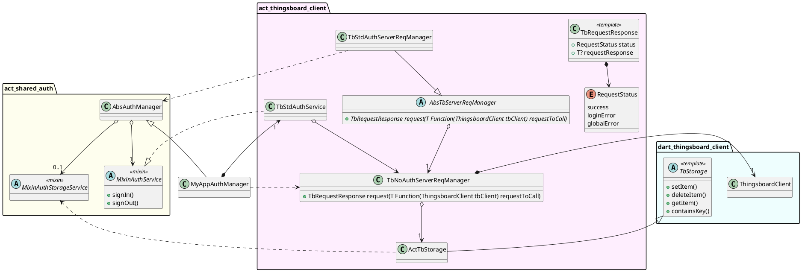
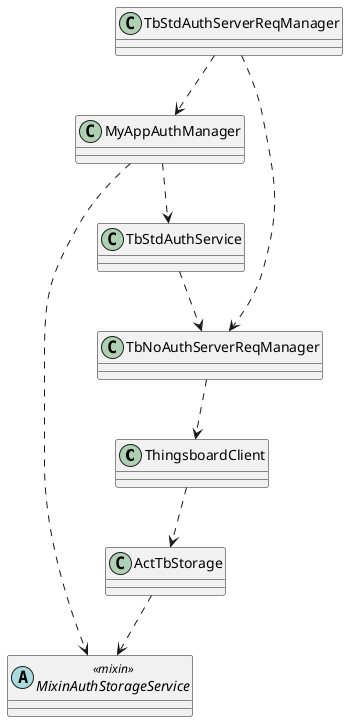

<!--
SPDX-FileCopyrightText: 2023 Benoit Rolandeau <benoit.rolandeau@allcircuits.com>

SPDX-License-Identifier: LicenseRef-ALLCircuits-ACT-1.1
-->

# ACT Thingsboard client <!-- omit from toc -->

## Table of contents

- [Table of contents](#table-of-contents)
- [Presentation](#presentation)
- [Architectural design](#architectural-design)
  - [Introduction](#introduction)
  - [Diagram](#diagram)
    - [Thingsboard authentication management](#thingsboard-authentication-management)

## Presentation

This package contains classes to use the Thingsboard client with app

## Architectural design

### Introduction

This package is an overlay to the Thingsboard library. It allows to use Thingsboard with the ACT
libs.

Thingsboard forces the usage of `ThingsboardClient` class to request the server and it manages
internally the storage of tokens.
Therefore, we have to twist the Thingsboard class for our usage.

### Diagram

#### Thingsboard authentication management

This class diagram describes the way we manage authentication with Thingsboard.

`MyAppAuthManager` is an example and represents the class implemented in a final app.

We slit the requests to Thingsboard server into two managers to register in your final app.

Because the `ThingsboardClient` needs a `TbStorage` and our implementation, `ActTbStorage`, uses
`MixinAuthStorageService`, we had to create a class which only calls requests without authentication
(requests which doesn't need of `TbStorage`) to avoid circular dependencies between the Thingsboard
manager and the `AbsAuthManager`.

That's why we create: `TbNoAuthServerReqManager`. This class creates the `ThingsboardClient` and the
`ActTbStorage`. But the last one isn't used in this manager (it's needed when we create the
`ThingsboardClient`).

Then we create an abstract class: `AbsTbServerReqManager` to call the requests which needs
authentication to the Thingsboard server.

To simplify, we can resume the class diagram to this dependencies diagram:

