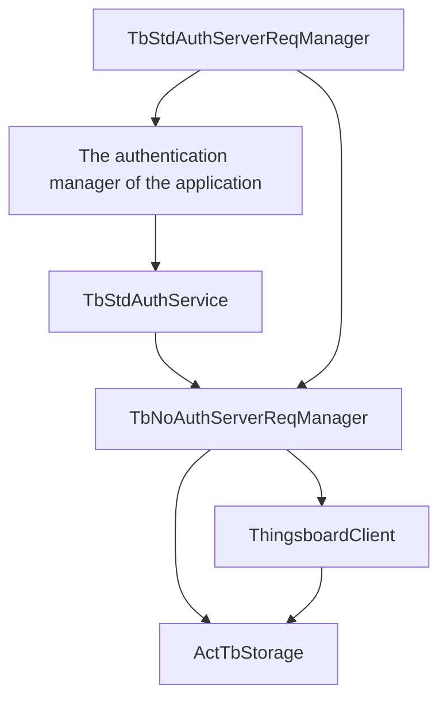
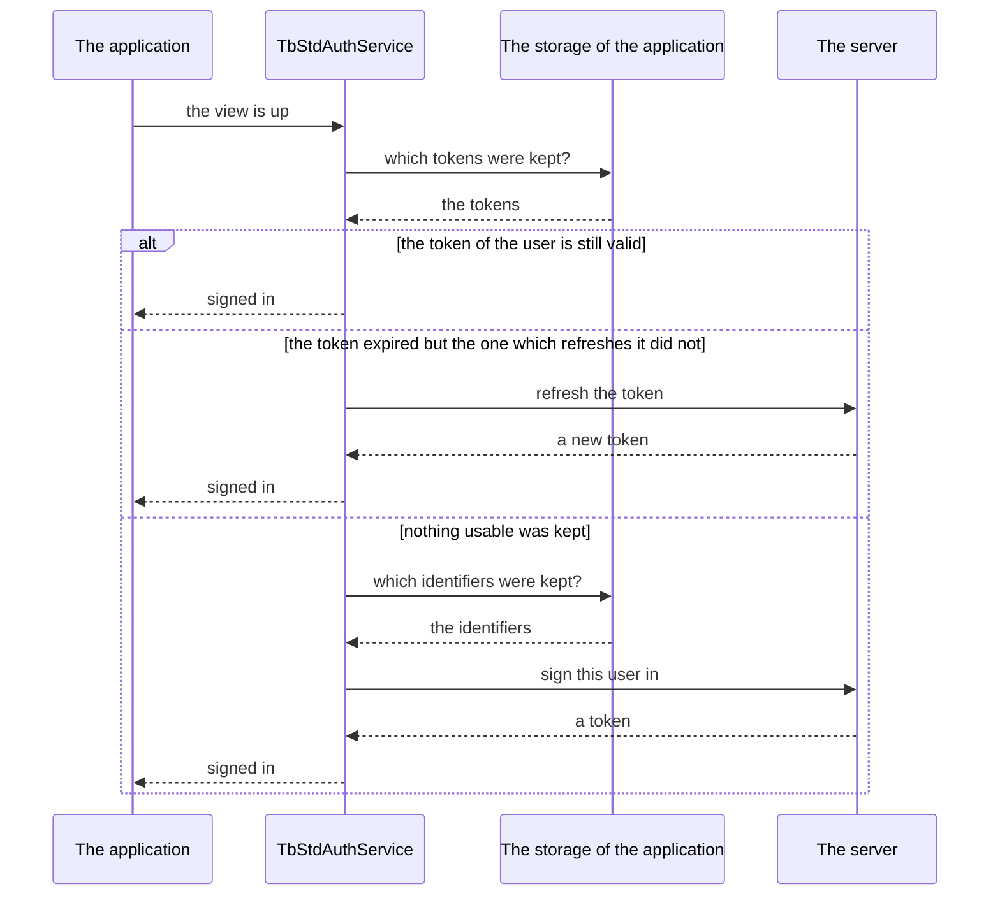
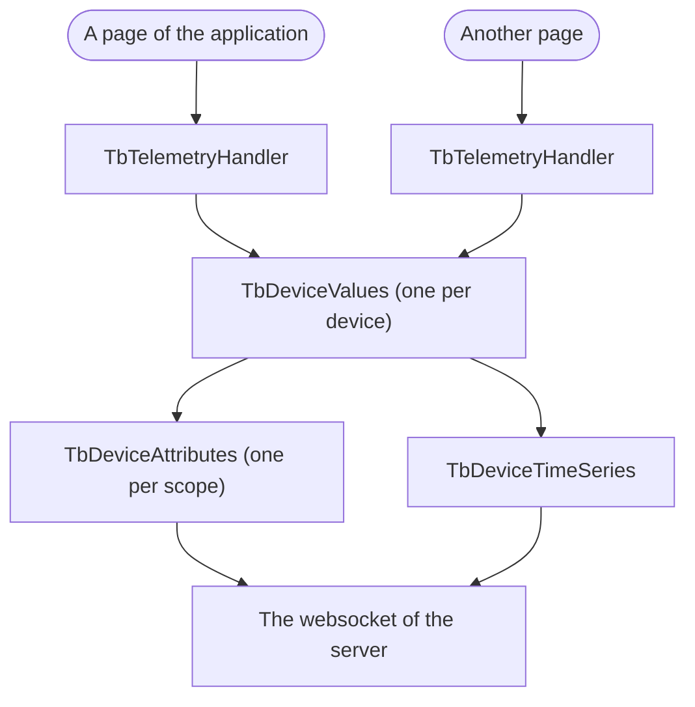

<!--
SPDX-FileCopyrightText: 2023 Benoit Rolandeau <benoit.rolandeau@allcircuits.com>

SPDX-License-Identifier: LicenseRef-ALLCircuits-ACT-1.1
-->

# ACT Thingsboard client <!-- omit from toc -->

## Table of contents <!-- omit from toc -->

- [Presentation](#presentation)
- [Architecture](#architecture)
  - [Why there are two managers](#why-there-are-two-managers)
  - [Where the tokens of the user live](#where-the-tokens-of-the-user-live)
  - [Signing a user in](#signing-a-user-in)
  - [The request which is tried again](#the-request-which-is-tried-again)
  - [Watching the telemetry of a device](#watching-the-telemetry-of-a-device)
  - [Reading a value](#reading-a-value)
- [How to use](#how-to-use)
  - [Installation](#installation)
  - [Declare the configuration](#declare-the-configuration)
  - [Register the managers](#register-the-managers)
  - [Sign the user in](#sign-the-user-in)
  - [Read the devices of the user](#read-the-devices-of-the-user)
  - [Watch the telemetry of a device](#watch-the-telemetry-of-a-device)
- [Configuration](#configuration)
- [Testing](#testing)

## Presentation

This package reaches a [Thingsboard](https://thingsboard.io) server: it signs the user in, reads the
devices which belong to that user, and watches the telemetry of those devices.

The server is reached through the `ThingsboardClient` of the `thingsboard_client` package, which
this one never exposes as it is. What it adds is what an application needs around that client:
the tokens of the user kept where the application keeps them rather than where the client would, a
status instead of an exception for every request, a token which is refreshed and a request which is
tried again when a session expires, and one subscription per device however many pages of the
application watch it.

It knows nothing of what the telemetry of a device means. Reading a value as a number, a date or a
boolean is offered, but the keys, the units and the meaning belong to the application.

## Architecture

### Why there are two managers


```mermaid
flowchart TD
    auth["The authentication manager of the application"]
    std["TbStdAuthServerReqManager"]
    noAuth["TbNoAuthServerReqManager"]
    service["TbStdAuthService"]
    storage["ActTbStorage"]
    client["ThingsboardClient"]

    auth --> service
    service --> noAuth
    std --> auth
    std --> noAuth
    noAuth --> client
    noAuth --> storage
    client --> storage
```

The client of the server needs a storage to keep the tokens of the user in, and the storage of this
package writes to the one the authentication of the application holds. Signing a user in also needs
the client. Both ends would depend on each other if there were a single manager.

`TbNoAuthServerReqManager` is the way out: it builds the client and the storage, and it requests the
server without ever asking who the user is. The authentication builds on it, and so does
`AbsTbServerReqManager`, the manager of the requests which need a user.

`TbStdAuthServerReqManager` is the implementation of that manager for a server which signs its users
in itself. An application whose users are signed in elsewhere writes its own by extending
`AbsTbServerReqManager`, and only has to say how a token reaches the client.

### Where the tokens of the user live

The client of the server keeps the token of the user and the token which refreshes it under two keys
of its own. `ActTbStorage` answers on those two keys and writes to the storage of the authentication
of the application, so the tokens live in one place only: a token written by the client is a token
the application finds again at the next start, and a token which is forgotten is forgotten on both
sides. Any other key is answered as missing, and an application which keeps nothing lets the client
keep nothing.

### Signing a user in


```mermaid
sequenceDiagram
    participant app as The application
    participant service as TbStdAuthService
    participant storage as The storage of the application
    participant server as The server

    app->>service: the view is up
    service->>storage: which tokens were kept?
    storage-->>service: the tokens
    alt the token of the user is still valid
        service-->>app: signed in
    else the token expired but the one which refreshes it did not
        service->>server: refresh the token
        server-->>service: a new token
        service-->>app: signed in
    else nothing usable was kept
        service->>storage: which identifiers were kept?
        storage-->>service: the identifiers
        service->>server: sign this user in
        server-->>service: a token
        service-->>app: signed in
    end
```

Three ways of signing a user in again are tried in that order, and the first which works stops the
others. Identifiers are only read when the storage of the application says it keeps them, and they
are forgotten as soon as the server refuses them.

Every change of the status of the user is pushed on a stream, and a status which did not change is
never pushed. A user who cannot be signed in again is `sessionExpired` rather than `signedOut`: the
application knows the difference between a user who left and a session which ran out.

### The request which is tried again

Every request to the server answers a `TbRequestResponse`, which carries a `RequestStatus` and what
the server answered. The error of the server is read as one of three things: the request went
through, the session is over, or something else went wrong. Nothing is ever raised at the caller.

A request which needs a user asks the authentication for the tokens, hands them to the client, and
requests the server. A session which is over has the whole thing done once more, and only once:
asking the tokens again is what refreshes them, so the second request is the one which counts. Any
other error is answered as it is, without a second try.

### Watching the telemetry of a device


```mermaid
flowchart TD
    page1(["A page of the application"])
    page2(["Another page"])
    handler1["TbTelemetryHandler"]
    handler2["TbTelemetryHandler"]
    values["TbDeviceValues (one per device)"]
    client["TbDeviceAttributes (one per scope)"]
    ts["TbDeviceTimeSeries"]
    server["The websocket of the server"]

    page1 --> handler1
    page2 --> handler2
    handler1 --> values
    handler2 --> values
    values --> client
    values --> ts
    client --> server
    ts --> server
```

A page which watches a device asks the service of the devices for a handler of its own. Two pages
which watch the same device are handed two handlers over the same `TbDeviceValues`, which is what
holds the values of that device and the subscriptions to the server. One subscription per scope of
the attributes and one for the time series is all the server ever sees, whatever the number of
handlers.

Adding or removing a key rebuilds the subscription, because the server subscribes to a list of keys
and not to a key: the subscription which is held is given up first, and a new one which carries
every key is asked for. A key which is no longer watched is kept for ten more seconds before it is
dropped, so a page which is left and opened again finds it there rather than paying for a new one.

Each handler only hears about the keys it asked for. What the other handlers of the same device
watch reaches them and not it.

### Reading a value

A value of the telemetry travels as the string the server sent, next to the moment it was received.
`TbTelemetriesHelper` reads such a string as an `int`, a `double`, a `bool` or a `String`, and
answers nothing when it cannot; the moment is read as a date in UTC. A value which arrives with a
moment older than the one which is held is dropped, because the server may send an update twice and
in any order.

An application which names its telemetry keys with an enum mixes `MixinTelemetriesKeys` into it and
hands the enum values over rather than strings.

## How to use

### Installation

Add the package to the `dependencies` of your package:

```yaml
dependencies:
  act_thingsboard_client:
    path: ../act_thingsboard_client
```

### Declare the configuration

```dart
class AppConfigManager extends AbstractConfigManager with MixinThingsboardConf {}
```

### Register the managers

```dart
class AppAuthManager extends AbsAuthManager {
  @override
  Future<MixinAuthService> getAuthService() async => TbStdAuthService();

  @override
  Future<MixinAuthStorageService?> getStorageService() async => AppAuthStorageService();
}

class AppGlobalManager extends AbsGlobalManager {
  @override
  Future<void> registerManagers() async {
    registerManagerAsync(AppConfigBuilder());
    registerManagerAsync(TbNoAuthServerReqBuilder<AppConfigManager, AppAuthManager>());
    registerManagerAsync(AppAuthBuilder());
    registerManagerAsync(TbStdAuthServerReqBuilder<AppAuthManager>());
  }
}
```

`TbNoAuthServerReqBuilder` is registered before the authentication, which depends on it. The
authentication is what holds `TbStdAuthService`, and `TbStdAuthServerReqBuilder` is what the pages
request the server through.

### Sign the user in

```dart
final auth = globalGetIt().get<AppAuthManager>().authService;

final result = await auth.signInUser(username: "a user", password: "a password");
if (result.status == AuthSignInStatus.done) {
  ...
}
```

### Read the devices of the user

```dart
final devices = globalGetIt().get<TbStdAuthServerReqManager>().devicesService;

final page = await devices.getCurrentCustomerDevices();
final (success: found, deviceInfo: device) = await devices.getCustomerDeviceByName(
  deviceName: "a device",
);
```

Anything the server can be asked which this package does not offer is one call away:

```dart
final response = await globalGetIt().get<TbStdAuthServerReqManager>().request(
  (tbClient) async => tbClient.getCustomerService().getCustomer(aCustomerId),
);

if (response.isOk) {
  ...
}
```

### Watch the telemetry of a device

```dart
enum AppTelemetryKeys with MixinTelemetriesKeys {
  temperature("temp"),
  humidity("hum");

  @override
  final String tbKey;

  const AppTelemetryKeys(this.tbKey);
}

final handler = globalGetIt()
    .get<TbStdAuthServerReqManager>()
    .devicesService
    .createTelemetryHandler(deviceId);

await handler.addKeys(
  sharedKeys: [AppTelemetryKeys.temperature],
  tsKeys: [AppTelemetryKeys.humidity],
);

handler.timeSeriesStream.listen(_onTimeSeriesUpdated);
handler.attributesStream.listen(_onAttributesUpdated);

final temperature = TbTelemetriesHelper.getAttributeValue<double>(
  handler.getAttributeValues()[AppTelemetryKeys.temperature.tbKey],
);
```

A page which closes has to close its handler, otherwise the device is watched forever:

```dart
await handler.close();
```

## Configuration

| Key                       | Type   | Default | What it is                                    |
| ------------------------- | ------ | ------- | --------------------------------------------- |
| `thingsboard.host`        | String |         | The host of the server, without a scheme      |
| `thingsboard.port`        | int    | none    | The port of the server, the default one if it is absent |
| `thingsboard.enableTls`   | bool   | `true`  | Whether the server is reached over TLS        |

The host is the only one which is needed: a manager whose configuration names none gives up on
initialization. Reaching a server without TLS is meant for a stack which runs on the machine of a
developer; anything else has to stay secure.

## Testing

The tests drive the package over a client of the server which answers what each test lined up and
records what it was asked, and over the websocket the telemetry of a device is pushed on. The client
is the boundary of this package, so it is the only thing which is stood in for: the storage of the
tokens, the configuration, the requests and the subscriptions are the real ones.

The storage of the tokens is covered through the real client on the two keys it knows, on the key it
knows nothing about, on the token which is written while the other one is left alone, and on the
application which keeps nothing. The manager which requests the server without a user is covered on
the configuration which names no server, and on every error of the server which becomes a status.

Signing a user in is covered on the three ways of signing a user in again, on the identifiers which
are kept and on the ones the server refuses, on the sign out, and on what is pushed on the stream of
the status. The request which needs a user is covered on the tokens which are handed to the client,
on the session which is over and has the request done once more, on the second failure which is
given up on, and on the error which is answered without a second try.

The telemetry is covered on the keys which are asked of the server and the order they are asked in,
on the subscription which is rebuilt when a key is added, on the one which is kept when the server
refuses, on the value which is newer and the one which is older, on the update which carries an
error, and on the closing which gives the subscription up. The handler is covered on the four kinds
of telemetry, on the keys of another handler it says nothing about, and on the device two handlers
watch through a single subscription. The devices of a customer are covered on the pages which are
read until the device is found.

What is out of reach is the ten seconds a key which is no longer watched is kept for, and the
address the client is built with: the first is read from the clock of the device rather than from a
timer a test can move, and the second is kept by the client without ever being answered.

```console
> flutter test
```
