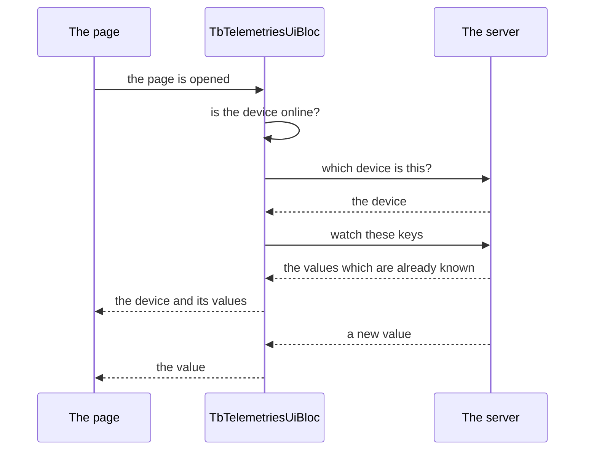

<!--
SPDX-FileCopyrightText: 2023 Benoit Rolandeau <benoit.rolandeau@allcircuits.com>

SPDX-License-Identifier: LicenseRef-ALLCircuits-ACT-1.1
-->

# ACT Thingsboard client UI <!-- omit from toc -->

## Table of contents <!-- omit from toc -->

- [Presentation](#presentation)
- [Architecture](#architecture)
  - [What a page goes through first](#what-a-page-goes-through-first)
  - [What the state holds](#what-the-state-holds)
  - [The internet which comes back](#the-internet-which-comes-back)
  - [Reading a value in the page](#reading-a-value-in-the-page)
- [How to use](#how-to-use)
  - [Installation](#installation)
  - [A page which only watches telemetry](#a-page-which-only-watches-telemetry)
  - [A page which does more](#a-page-which-does-more)
- [Testing](#testing)

## Presentation

This package is the page side of `act_thingsboard_client`: a bloc which watches the telemetry of one
device of a Thingsboard server, and a state a page reads it from.

What it adds to the client is what a page needs and the client does not offer: the device is found
by what the page knows of it, the values which already arrived are read at once rather than waited
for, the loading of the page ends on the first value, and the reason a page shows nothing is one of
four named errors rather than a silence.

It displays nothing. There is no widget in it: the pages are those of the application, and this
package only feeds them.

## Architecture

### What a page goes through first



The bloc initializes itself as soon as it is built, and each step of that initialization has its own
error: a device which is offline is `noInternetAtStart`, a server which cannot be asked is
`serverError`, a device the server does not know is `unknownDevice`. Only one of them is worth
trying again, and `canRetryRequest` is what says so: a device which does not exist will not start
existing.

The values which are already known are read right after the subscription. That is what keeps a page
which is opened a second time from showing a spinner over values the client already holds.

### What the state holds

The state holds the device, the values of the time series, the values of the attributes of every
scope, whether the page is loading, and the error if there is one. New values are merged into the
ones which are held rather than replacing them, so a page which watches four keys and receives one
keeps the other three.

The loading ends on the first value which is not empty. An update which carries nothing leaves the
page loading, because nothing was received.

### The internet which comes back

A device which was offline when the page was opened is not a dead end. The bloc follows the
internet of the device from that moment on, and it initializes itself again as soon as the
connection is back; the page then goes from the error to the values without the user doing anything.
Once the connection has been used, it stops being followed.

### Reading a value in the page

A value of the telemetry travels as the string the server sent. The state reads it for the page:
`getTsValue<double>` and `getAttributeValue<int>` read a value as the type which is asked for, and
`getTsLastUtcReceptionTime` reads the moment it was received. A page names the keys with the enum of
the application rather than with strings.

## How to use

### Installation

Add the package to the `dependencies` of your package:

```yaml
dependencies:
  act_thingsboard_client_ui:
    path: ../act_thingsboard_client_ui
```

### A page which only watches telemetry

```dart
enum AppTelemetryKeys with MixinTelemetriesKeys {
  temperature("temp"),
  humidity("hum");

  @override
  final String tbKey;

  const AppTelemetryKeys(this.tbKey);
}

final bloc = TbTelemetriesUiBloc<AppTbReqManager>(
  getDeviceInfo: MixinTbTelemetriesUiBloc.getCallbackFromDeviceName<AppTbReqManager>(
    deviceName: "a device",
  ),
  timeSeriesKeys: [AppTelemetryKeys.temperature],
  sharedAttributesKeys: [AppTelemetryKeys.humidity],
);
```

The page reads its state:

```dart
BlocBuilder<TbTelemetriesUiBloc<AppTbReqManager>, TbTelemetriesUiState>(
  builder: (context, state) {
    if (state.telemetryLoading) {
      return const CircularProgressIndicator();
    }

    if (state.genericError.isError) {
      return ErrorView(canRetry: state.canRetryRequest);
    }

    return Text("${state.getTsValue<double>(AppTelemetryKeys.temperature)}");
  },
)
```

### A page which does more

A page which has a bloc of its own mixes the telemetry into it, on both the bloc and its state:

```dart
class DevicePageState extends BlocStateForMixin<DevicePageState>
    with MixinTbTelemetriesUiState<DevicePageState> {
  ...

  @override
  DevicePageState copyWithTbTelemetriesState({...}) => copyWith(...);
}

class DevicePageBloc extends BlocForMixin<DevicePageState>
    with
        MixinAsyncInitBloc<DevicePageState>,
        MixinTbTelemetriesUiBloc<AppTbReqManager, DevicePageState> {
  @override
  final GetDeviceInfo getDeviceInfo;

  @override
  List<MixinTelemetriesKeys> get timeSeriesKeys => [AppTelemetryKeys.temperature];

  ...
}
```

## Testing

The tests drive the bloc over a real manager of the requests to the server, itself over a client
which answers what each test lined up, and over the websocket the telemetry of a device is pushed
on. The service of the devices and the handler of the telemetry are the real ones, so what is
covered is the whole way from the websocket to the state of the page.

The initialization is covered on the device the page names and the keys which are watched for it, on
the loading which lasts until a value arrives, and on every error: the device which is offline, the
server which cannot be asked, the device the server does not know, the device which carries no
identifier, and the subscription the server refuses. The internet is covered on the connection which
comes back and has the page watch the telemetry after all.

The state is covered on the values which are merged into the ones which are held, on the value of a
key which is received a second time, on the update which carries nothing and leaves the page
loading, on the errors which can be tried again and the ones which cannot, and on the reading of a
value and of the moment it was received.

```console
> flutter test
```
