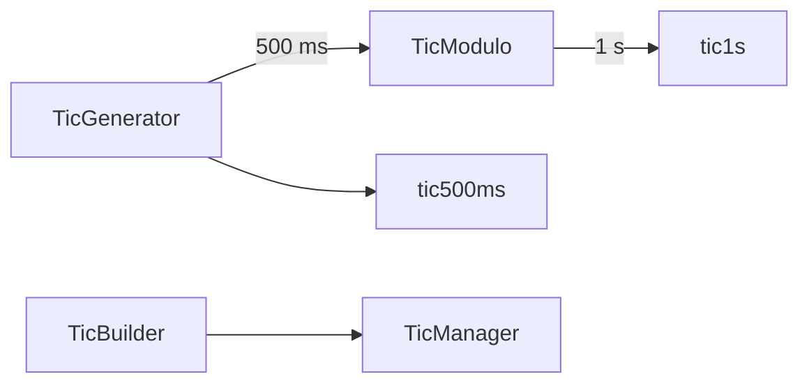

<!--
SPDX-FileCopyrightText: 2023 Benoit Rolandeau <benoit.rolandeau@allcircuits.com>

SPDX-License-Identifier: LicenseRef-ALLCircuits-ACT-1.1
-->

# ACT Tic manager <!-- omit from toc -->

## Table of contents

- [Table of contents](#table-of-contents)
- [Presentation](#presentation)
- [Architecture](#architecture)
  - [The generator](#the-generator)
  - [The modulo](#the-modulo)
  - [The manager](#the-manager)
- [How to use](#how-to-use)
  - [Installation](#installation)
  - [Register the manager](#register-the-manager)
  - [Blink at the same pace everywhere](#blink-at-the-same-pace-everywhere)
- [Testing](#testing)

## Presentation

This package contains a tic manager which helps to display HMI in pace.

Two widgets which each own their timer drift apart, and a screen where every blinking element blinks
on its own beat looks wrong. The manager owns the timers instead, and the widgets listen: everything
which reads the same tic changes at the same moment.

The package only counts. It knows nothing about what the numbers drive, and it never rebuilds
anything itself.

## Architecture



### The generator

`TicGenerator` owns a periodic timer and publishes an incrementing counter. The counter starts at
zero and wraps at `TicManager.countersMaxValue`, so it stays an unsigned value of 32 bits rather
than the signed value of 64 bits `Stream.periodic` would give.

Its stream keeps its current value, so a widget which starts listening in the middle receives that
value at once instead of waiting for the next tic.

The interval has to be a duration to wait: an assertion refuses zero and a negative one.

### The modulo

`TicModulo` derives a slower counter from a source one: it counts one tic every time the source
value is a factor of its modulo. Deriving rather than starting another timer is what keeps the two
paces in step, so a second exactly covers two half seconds.

Its counter is a count of its own tics, not of the source ones, and it wraps the same way.

### The manager

`TicManager` builds the pair the applications use: `tic500ms`, straight from the generator, and
`tic1s`, derived from it with a modulo of two. Both are running as soon as the manager is built.

`TicBuilder` is the factory to register the manager with, and it depends on no other manager.

## How to use

### Installation

Add the package to the `dependencies` of your package:

```yaml
dependencies:
  act_tic_manager:
    path: ../act_tic_manager
```

### Register the manager

```dart
GlobalManager.instance.register(TicBuilder());
```

### Blink at the same pace everywhere

```dart
StreamBuilder<int>(
  stream: globalGetIt().get<TicManager>().tic500ms,
  builder: (context, snapshot) => Opacity(
    opacity: (snapshot.data ?? 0).isEven ? 1 : 0,
    child: const WarningIcon(),
  ),
);
```

Every widget built this way turns its icon on and off on the same tic.

## Testing

The tests run under a fake clock, so they never wait on a real delay. They cover the value a
generator starts at and the one it reaches after a given number of intervals, the value a late
listener receives, the intervals a generator refuses, the source values a modulo keeps and the ones
it drops, the modulos it refuses, and the fact that the slow tic of the manager only fires on an
even fast one.

```console
> flutter test
```
