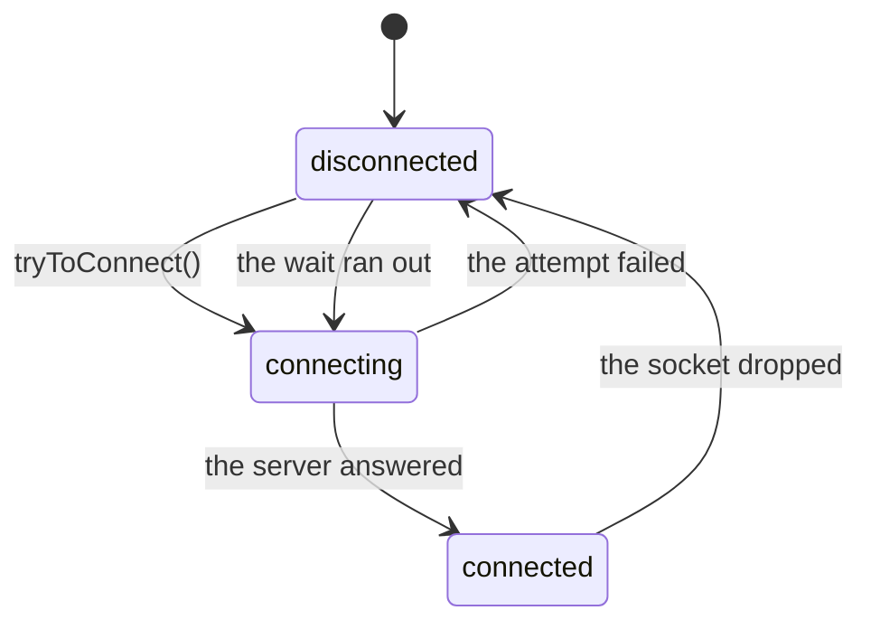

<!--
SPDX-FileCopyrightText: 2025 Benoit Rolandeau <benoit.rolandeau@allcircuits.com>

SPDX-License-Identifier: LicenseRef-ALLCircuits-ACT-1.1
-->

# ACT WebSocket client Manager <!-- omit from toc -->

## Table of contents

- [Table of contents](#table-of-contents)
- [Presentation](#presentation)
- [Architecture](#architecture)
  - [The three states of the connection](#the-three-states-of-the-connection)
  - [Connecting again by itself](#connecting-again-by-itself)
  - [Reading the messages](#reading-the-messages)
  - [Talking to several servers](#talking-to-several-servers)
- [How to use](#how-to-use)
  - [Installation](#installation)
  - [Register the manager](#register-the-manager)
  - [Read the events of the server](#read-the-events-of-the-server)
- [Configuration](#configuration)
- [Testing](#testing)

## Presentation

This package holds the WebSocket an application keeps open with a server: it opens it, tells the
application what goes over it, sends what the application asks, and opens it again when it drops.

It decides nothing about what the messages mean. An application which sends and reads plain text
reads the stream of the manager; one which speaks in events writes a parser.

## Architecture

### The three states of the connection

The connection is `disconnected`, `connecting` or `connected`, and the manager tells the
application about every change on a stream of its own.

Only one attempt runs at a time: the calls which ask to connect, to send or to close wait for one
another, so a manager never opens two sockets nor closes one which is being opened. A manager
which is already connected and is asked to connect says it is, and opens nothing.

Closing the WebSocket is the application saying it is done: the socket is closed, the automatic
reconnection stops, and nothing is sent afterwards. The application can still ask to connect
again.

### Connecting again by itself

When the socket drops - because the server went away, because the network did, or because the
first attempt never succeeded - the manager waits and tries again, for as long as the connection
is not back. The wait grows from the initial duration towards the maximum one, so a server which
is down is not asked again every few milliseconds.

An application which does not want that says so, in its configuration or when it asks to connect.



### Reading the messages

Every message the server sends reaches the application twice: through the parsers the application
registered, and on the stream of received messages. The parsers are handed the message first, so a
page which reads the stream sees a state the parsers already brought up to date.

`AbsWsEventMsgParser` is the parser of a server which speaks in events: a message is a json object
which names an event and carries its data, and the parser hands the data to whoever registered for
that event. A message which is not json, whose event the application does not know, or which
carries no data, is dropped and said so in the logs. The two keys are the usual `event` and `data`
unless the server names them otherwise.

### Talking to several servers

An application which talks to a second server registers a second manager, built by a builder of
its own, and each one reads its own configuration. That is what
`AbstractWebsocketClientDerivedBuilder` is for.

## How to use

### Installation

Add the package to the `dependencies` of the application:

```yaml
dependencies:
  act_websocket_client_manager:
    path: ../act_websocket_client_manager
```

### Register the manager

The configuration of the application takes `MixinWebsocketClientConfig`, then:

```dart
globalManager.registerManagerAsync<WebsocketClientManager>(
  WebsocketClientDerivedBuilder<AppConfigManager>(),
);
```

An application which wants its own parsers or its own protocols overrides the configuration of the
manager:

```dart
class MyWsManager extends WebsocketClientManager {
  MyWsManager() : super(configGetter: globalGetIt().get<AppConfigManager>);

  @override
  Future<WsClientManagerConfig> getConfig({required LogsHelper logsHelper}) async {
    final config = await super.getConfig(logsHelper: logsHelper);

    return config.copyWith(msgParsers: [MyEventParser(parentLogger: logsHelper)]);
  }
}
```

### Read the events of the server

```dart
enum ServerEvents with MixinStringValueType {
  itemAdded,
  itemRemoved;

  @override
  String? get stringValueOverride => null;
}

class MyEventParser extends AbsWsEventMsgParser<ServerEvents> {
  MyEventParser({super.parentLogger})
    : super(eventsList: ServerEvents.values, logsCategory: "items") {
    registerEventCallback(ServerEvents.itemAdded, _onItemAdded);
  }

  Future<void> _onItemAdded(dynamic data) async {
    ...
  }
}
```

## Configuration

- `webSocket.client.url` (string): the server the application talks to. It has no default, and an
  application which names none does not start.
- `webSocket.client.logReceivedMsg` (bool, `false`): writes every message received.
- `webSocket.client.autoReconnect.enable` (bool, `true`): connects again after a drop.
- `webSocket.client.autoReconnect.initDuration` (int, `500`): the first wait, in milliseconds.
- `webSocket.client.autoReconnect.maxDuration` (int, `3000`): the longest wait, in milliseconds.

## Testing

The tests run a real WebSocket server on the loopback, on a port the machine chooses, and drive
the manager against it: the connection it opens at the start or on request, the messages which go
each way, the socket the server closes under it, the connection it opens again by itself and the
one it does not when the application said not to, and the manager which stops answering once it is
closed.

They wait for what the manager says on its stream rather than for a delay, and the reconnection of
a manager under test waits milliseconds where a real one waits seconds.

The parser of events is driven without a socket, on the messages it is handed, including the ones
it drops.

```console
> flutter test
```
