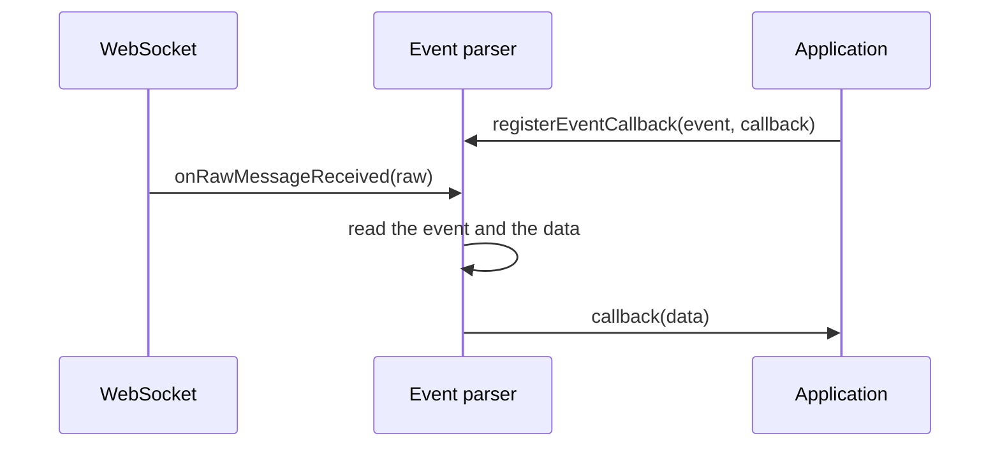

<!--
SPDX-FileCopyrightText: 2025 Benoit Rolandeau <benoit.rolandeau@allcircuits.com>

SPDX-License-Identifier: LicenseRef-ALLCircuits-ACT-1.1
-->

# ACT WebSocket core <!-- omit from toc -->

## Table of contents

- [Table of contents](#table-of-contents)
- [Presentation](#presentation)
- [Architecture](#architecture)
  - [The raw layer](#the-raw-layer)
  - [The event layer](#the-event-layer)
  - [What a malformed message does](#what-a-malformed-message-does)
- [How to use](#how-to-use)
  - [Installation](#installation)
  - [Declare the events of an application](#declare-the-events-of-an-application)
  - [Write a service](#write-a-service)
- [Testing](#testing)

## Presentation

This package holds the message format shared by the two ends of a WebSocket: the one which is a
client and the one which is a server. Both speak the same messages, so what turns an event into
bytes and bytes back into an event belongs here rather than in either of them.

It opens no socket and holds no connection. Writing a message on a channel and being told when one
arrives is the business of the manager which owns the socket.

## Architecture

The package is four mixins, in two layers.

### The raw layer

`MixinWsMsgSenderService` and `MixinWsMsgParserService` are what the manager owning the socket
implements: one method to write a raw message, one method called when a raw one arrives. A raw
message is whatever a WebSocket carries, which is a string or bytes.

### The event layer

`MixinWsEventMsgSenderService` and `MixinWsEventMsgParserService` are mixed on top of the raw ones,
and turn those raw messages into the events of an application. A message is a JSON object with two
fields:

```json
{ "event": "device-state", "data": { "isOn": true } }
```

The names of those two fields are the ones the service declares, so a service which talks to a
server naming them otherwise only has to say so.

An event is a value of an enum of the application, which carries the name it goes by on the wire.
A service registers one callback per event it cares about, and the parser hands it the data of the
message:



Sending goes the other way: the sender builds the JSON object from an event and a payload, encodes
it, and hands it to the raw sender. It answers false when the message could not be written, which
covers both a channel which is not connected and a payload which is not JSON.

### What a malformed message does

A message is dropped, with a warning, when it is neither a string nor a JSON object, when the
string it carries is not JSON, when it carries no event or an event the service does not know, or
when it carries no data for an event the service listens to.

A message whose event the service knows but has registered no callback for is dropped silently: a
service is not expected to listen to every event which travels on the socket.

## How to use

### Installation

Add the package to the `dependencies` of your package:

```yaml
dependencies:
  act_websocket_core:
    path: ../act_websocket_core
```

### Declare the events of an application

An event names itself on the wire through `MixinStringValueType`, which uses the name of the value
unless it is given another one:

```dart
enum DeviceEvent with MixinStringValueType {
  measure,
  deviceState;

  @override
  String? get stringValueOverride => switch (this) {
        DeviceEvent.deviceState => "device-state",
        _ => null,
      };
}
```

### Write a service

The service brings the two raw methods, the keys of the two fields, the events it knows and the map
its callbacks are kept in:

```dart
class DeviceWsService extends AbsWithLifeCycle
    with
        MixinWsMsgParserService,
        MixinWsMsgSenderService,
        MixinWsEventMsgParserService<DeviceEvent>,
        MixinWsEventMsgSenderService<DeviceEvent> {
  @override
  final LogsHelper logsHelper;

  @override
  final String eventJsonKey = MixinWsEventMsgParserService.defaultJsonEventKey;

  @override
  final String dataJsonKey = MixinWsEventMsgParserService.defaultJsonDataKey;

  @override
  final Map<DeviceEvent, EventMessageCallback> eventCallbacks = {};

  @override
  List<DeviceEvent> get eventsList => DeviceEvent.values;

  @override
  Future<void> initLifeCycle() async {
    await super.initLifeCycle();
    registerEventCallback(DeviceEvent.measure, _onMeasure);
  }

  @override
  Future<bool> sendRawMessage(dynamic message) => _channel.send(message);
}
```

Sending an event is then one call:

```dart
if (!await service.sendMessage(event: DeviceEvent.measure, data: {"value": 42})) {
  // The socket is not connected, or the payload is not JSON
}
```

## Testing

The tests drive a service which mixes the four layers over a channel the test stands in for. They
cover the message read from a string and from a JSON object already decoded, the event read from
the name it carries on the wire, the keys a service renames, the data handed to the callback of its
event, and the callbacks which are not called because the service does not listen to that event.

Every message which is dropped is covered too, with the warning it leaves behind: the ones which
are not JSON objects, the ones which carry no event or an unknown one, and the ones which carry no
data.

On the sending side, the tests read what was written on the channel: the JSON object built from an
event and a payload, the keys it is written under, the message refused because the channel is not
connected, and the payload which cannot be encoded.

```console
> flutter test
```
