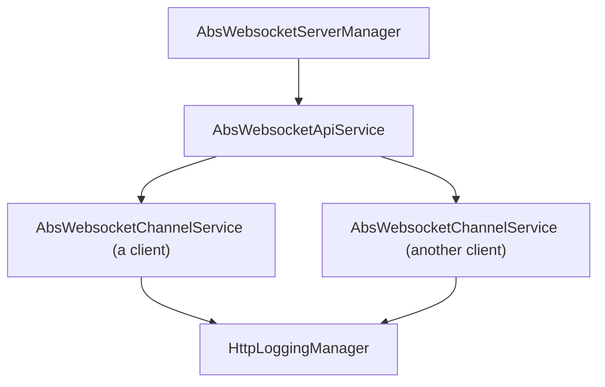
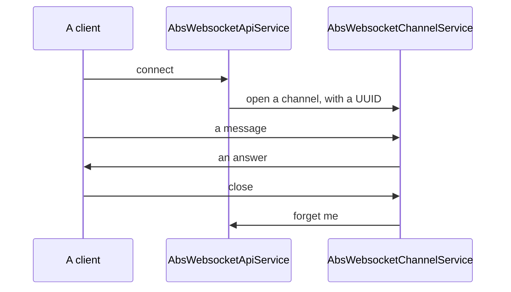

<!--
SPDX-FileCopyrightText: 2025 Benoit Rolandeau <benoit.rolandeau@allcircuits.com>

SPDX-License-Identifier: LicenseRef-ALLCircuits-ACT-1.1
-->

# ACT WebSocket server manager  <!-- omit from toc -->

## Table of contents

- [Table of contents](#table-of-contents)
- [Presentation](#presentation)
- [Architecture](#architecture)
  - [The manager, the service and the channels](#the-manager-the-service-and-the-channels)
  - [The route the clients connect on](#the-route-the-clients-connect-on)
  - [The life of a client](#the-life-of-a-client)
  - [Speaking with events](#speaking-with-events)
  - [What is written in the logs](#what-is-written-in-the-logs)
- [How to use](#how-to-use)
  - [Installation](#installation)
  - [Write the channel of a client](#write-the-channel-of-a-client)
  - [Write the service and the manager](#write-the-service-and-the-manager)
  - [Register the manager](#register-the-manager)
  - [Speak to the clients](#speak-to-the-clients)
- [Configuration](#configuration)
- [Testing](#testing)

## Presentation

This package runs the WebSocket server of an application: one route the clients connect on, one
channel per client which is connected, and the sending of a message to one of them or to all of
them.

It is the HTTP server of `act_http_server_manager` with one service which upgrades its route to a
WebSocket, so a server which also answers ordinary requests is written with that package and this
one is for a server which only speaks WebSocket.

It decides nothing about what travels: the messages are raw, and an application which speaks with
named events reads them through `act_websocket_core`.

## Architecture

### The manager, the service and the channels



- the manager is the HTTP server, and the only service it holds is the WebSocket one. It adds no
  handler of its own: nothing is wrapped around a route which is upgraded,
- the service holds the route, opens a channel per client and knows every channel which is open. It
  is the one which sends a message to all of them,
- a channel is one client: it reads what that client sends, writes what the application sends it,
  and is closed when the client goes away.

A channel is named after a UUID the service gives it, which is what the logs of a server are read
by and what a channel is looked up under.

### The route the clients connect on

The route is the base path of the service, without its trailing separator: a service whose relative
path is `events`, under a server whose base path is `/api`, is reached at
`ws://host:port/api/events`. A service which names no relative path answers at the root.

The configuration of the WebSocket says what the handshake accepts:

- the sub protocols the server knows, of which the first one the client also knows is the one they
  speak. A client which shares none is told nothing, which usually makes it hang up,
- the origins a browser is allowed to connect from, which is what keeps a script of another page
  from opening a socket. A program which is not a browser connects whatever that says,
- the interval a ping is sent at, which is how a client which went away without saying so is
  noticed.

### The life of a client



A channel which is closed is forgotten by the service, whether it was the client which hung up, an
error on the socket, or the application which closed the channel itself. Sending anything on a
channel which is closed answers false rather than raising.

Closing the server closes every channel it holds.

### Speaking with events

`AbsWsEventChannelService` is the channel of an application whose messages are json objects which
name an event and carry its data. It reads such a message, finds the event in the list of the ones
the application knows, and calls the callback which was registered for it; a message which names an
event the application does not know is dropped.

`MixinWsEventApiService` adds to the service the sending of one event to every client which is
connected.

### What is written in the logs

Every channel writes to the logging manager of the server, under the UUID of its client: the client
which starts listening, the one which stops, every message which travels, in and out, and the errors
of the socket. That is what makes a session readable afterwards, since a WebSocket has no request to
read a route from.

## How to use

### Installation

Add the package to the `dependencies` of your package:

```yaml
dependencies:
  act_websocket_server_manager:
    path: ../act_websocket_server_manager
```

### Write the channel of a client

```dart
enum AppEvents with MixinStringValueType {
  hello,
  goodbye;

  @override
  String? get stringValueOverride => null;
}

class AppChannelService extends AbsWsEventChannelService<AppEvents> {
  AppChannelService({
    required super.webSocket,
    required super.httpLoggingManager,
    required super.onClose,
  }) : super(eventsList: AppEvents.values) {
    registerEventCallback(AppEvents.hello, _onHello);
  }

  Future<void> _onHello(dynamic data) async => sendMessage(event: AppEvents.goodbye, data: data);
}
```

### Write the service and the manager

```dart
class AppWsService extends AbsWebsocketApiService<AppChannelService>
    with MixinWsEventApiService<AppEvents, AppChannelService> {
  AppWsService({required super.httpLoggingManager, required super.config})
      : super(serviceRelativePath: "events");

  @override
  Future<WebsocketServerConfig> getWsConfig() async =>
      const WebsocketServerConfig(pingInterval: Duration(seconds: 30));

  @override
  Future<AppChannelService> createChannelService({
    required HttpLoggingManager httpLoggingManager,
    required WebSocketChannel channel,
    required String? subProtocol,
    required void Function(String clientUuid) onClose,
  }) async =>
      AppChannelService(
        webSocket: channel,
        httpLoggingManager: httpLoggingManager,
        onClose: onClose,
      );
}

class AppWsServerManager extends AbsWebsocketServerManager with MixinFromConfigWsServerManager {
  @override
  MixinWebsocketServerConfig Function() get configGetter => globalGetIt().get<AppConfigManager>;

  @override
  Future<AbsWebsocketApiService> getWebsocketService({
    required HttpServerConfig config,
    required HttpLoggingManager httpLoggingManager,
  }) async => AppWsService(httpLoggingManager: httpLoggingManager, config: config);
}

class AppWsServerBuilder extends AbsWebsocketServerBuilder<AppWsServerManager> {
  const AppWsServerBuilder(super.factory);
}
```

### Register the manager

```dart
GlobalManager.instance.register(AppWsServerBuilder(AppWsServerManager.new));
```

### Speak to the clients

```dart
final service = globalGetIt().get<AppWsServerManager>().apiServices.first as AppWsService;

await service.sendMessageToAll(event: AppEvents.goodbye, data: "the server is closing");
```

## Configuration

An application which reads the address of its server from its configuration mixes
`MixinWebsocketServerConfig` into its configuration manager and `MixinFromConfigWsServerManager`
into its server manager:

| Key                        | Default            | What it does                        |
| -------------------------- | ------------------ | ----------------------------------- |
| `webSocket.server.name`    | `WebSocket server` | The name the logs call the server by |
| `webSocket.server.hostname` | `0.0.0.0`         | The address the server answers on    |
| `webSocket.server.port`    | `80`               | The port the server answers on       |
| `webSocket.server.basePath` | none              | The path every route is under        |

The configuration of the WebSocket itself, the sub protocols and the origins, is not read from
there: it is the answer of the service.

## Testing

The tests run a real server on the loopback and connect real clients to it, on a port the machine
chooses: what is driven is a WebSocket, and nothing between the client and the channel is stood in
for.

The routes are covered on the service which answers at the root, the one which names a relative
path, and the base path of the server which is over both. The channels are covered on the client
which connects, the one which sends a message, the one which is sent one, the one which goes away
and is forgotten, and the sub protocol the two sides agree on. Closing is covered from both ends:
the client which hangs up, and the server which closes and takes every channel with it.

The events are covered on the message which names one the application knows, whose data reaches the
callback, on the message which names one it does not know, and on the event which is sent to every
client. The logs are covered on the client which starts and stops listening and on the messages
which travel.

```console
> flutter test
```
