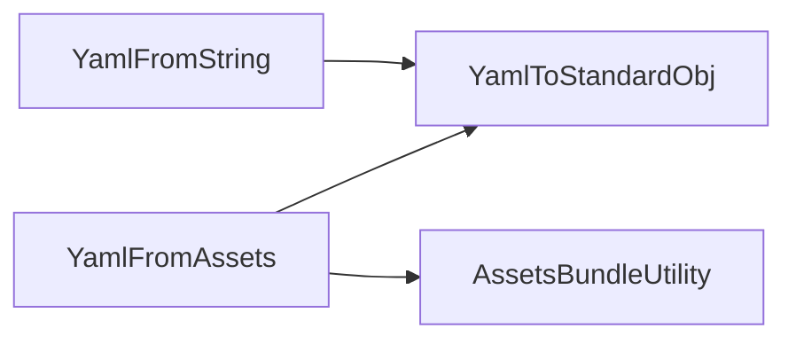

<!--
SPDX-FileCopyrightText: 2024 Benoit Rolandeau <benoit.rolandeau@allcircuits.com>

SPDX-License-Identifier: LicenseRef-ALLCircuits-ACT-1.1
-->

# ACT Yaml utility <!-- omit from toc -->

## Table of contents

- [Table of contents](#table-of-contents)
- [Presentation](#presentation)
- [Architecture](#architecture)
  - [From YAML objects to plain Dart ones](#from-yaml-objects-to-plain-dart-ones)
  - [From a string](#from-a-string)
  - [From the assets bundle](#from-the-assets-bundle)
- [How to use](#how-to-use)
  - [Installation](#installation)
  - [Read a configuration file of the assets](#read-a-configuration-file-of-the-assets)
  - [Parse a content received elsewhere](#parse-a-content-received-elsewhere)
- [Testing](#testing)

## Presentation

This package contains useful methods and classes to manage YAML files in the app.

It reads YAML and gives back the plain Dart objects `jsonDecode` would have given: maps, lists,
strings, numbers and booleans. A caller therefore reads a YAML file and a JSON file the same way,
which is what lets a configuration be written in either.

The conversion goes one way only: the package never writes YAML, and everything a YAML document
carries beyond its values, its comments first of all, is lost on the way.

## Architecture



The three classes answer the same question at three levels: what the content is read from.

### From YAML objects to plain Dart ones

`YamlToStandardObj` converts the objects of the `yaml` package. `fromYamlMap` and `fromYamlList`
walk their content in depth, so nothing of the `yaml` package is left in what they return.
`fromDoc` and `fromDocs` take a document and a stream of documents, and `fromYamlValue` accepts any
of them and returns the scalar values as they are.

### From a string

`YamlFromString` parses a content already in memory. `fromYaml` returns whatever is at the root,
while `fromYamlMap` and `fromYamlList` are for the callers which know which of the two they expect
and want anything else to be a failure.

The three of them return `null` when the content cannot be parsed, so a caller decides what an
invalid content means.

### From the assets bundle

`YamlFromAssets` reads the file through `AssetsBundleUtility` and parses it. Its three methods
mirror the ones above, and they report an `AssetsBundleResult` alongside the content, so the caller
tells a missing file from an invalid one.

A key without any extension is looked up with each of `yamlFileTypes` in turn, and the first file
found wins, which is why the order of that list is the order of priority. A key which already has an
extension is looked up as it is, and nothing else is tried.

## How to use

### Installation

Add the package to the `dependencies` of your package:

```yaml
dependencies:
  act_yaml_utility:
    path: ../act_yaml_utility
```

### Read a configuration file of the assets

```dart
final result = await YamlFromAssets.loadYamlMap("assets/config/local", cache: false);

switch (result.status) {
  case AssetsBundleResult.ok:
    _apply(result.data!);
  case AssetsBundleResult.notFound:
    _applyDefaults();
  case AssetsBundleResult.genericError:
    _logger.e("the configuration file cannot be read");
}
```

The key has no extension here, so `local.yaml`, `local.yml` and `local.json` are tried in that
order.

### Parse a content received elsewhere

```dart
final content = YamlFromString.fromYamlMap(downloadedContent);
if (content == null) {
  return const ResultWithBoolStatus(status: BoolResultStatus.error);
}
```

## Testing

The tests cover the conversion of the maps, the lists, the documents and the scalars including the
nested ones, the parsing of a content which is YAML, which is JSON and which is neither, the
mismatch between what a caller expects at the root and what the content holds, and the guessing of
the extension of a file of the assets, which is read through a fake bundle.

```console
> flutter test
```
