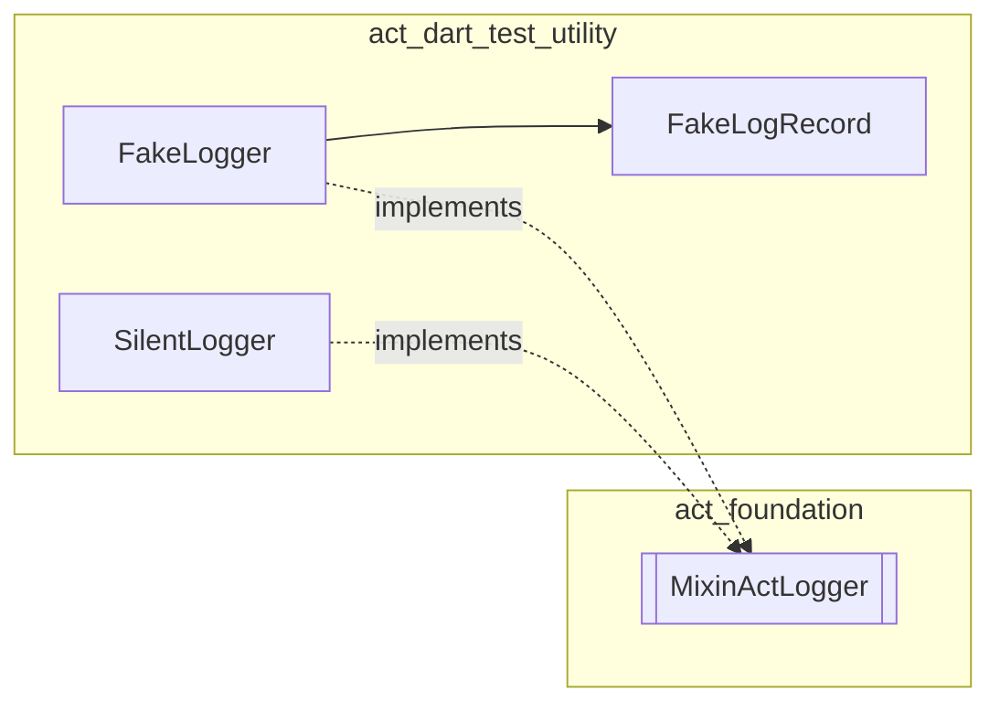

<!--
SPDX-FileCopyrightText: 2026 Benoit Rolandeau <benoit.rolandeau@allcircuits.com>

SPDX-License-Identifier: LicenseRef-ALLCircuits-ACT-1.1
-->

# ACT Dart Test utility <!-- omit from toc -->

## Table of contents

- [Table of contents](#table-of-contents)
- [Presentation](#presentation)
- [Architecture](#architecture)
- [How to use](#how-to-use)
  - [Installation](#installation)
  - [Assert on what was logged](#assert-on-what-was-logged)
  - [Silence the logs of a class under test](#silence-the-logs-of-a-class-under-test)
- [Testing](#testing)

## Presentation

This package contains the fakes and the helpers shared by the unit tests of the pure Dart ACT
packages. It exists so that the same fake is written once instead of being copied in every package
which needs it.

Unlike `act_test_utility`, this package does not depend on Flutter: it can be used from a package
whose tests run on the Dart VM. A fake which needs Flutter, or which fakes an ACT package that is
not itself pure Dart, belongs to `act_test_utility` instead, which re-exports this package so a
Flutter package still reaches every fake through a single import.

It is only meant to be added as a `dev_dependency`: nothing here is intended to run in an
application. It contains no test of its own for the other packages either; it only provides the
tools they use to write theirs.

This package depends on the ACT packages whose interfaces it fakes, and those packages use it in
their own tests: pub resolves such a cycle between packages linked by a path, as long as this one
is only ever a `dev_dependency`.

## Architecture

The package is organised by the kind of element it provides:

- `lib/src/fakes/` contains the fake implementations of the ACT interfaces,
- `lib/src/models/` contains the data classes those fakes expose to the tests.

Two implementations of the `MixinActLogger` interface of `act_foundation` are available, and the
choice between them depends on what the test asserts:

| Class          | Behaviour                                  | Use it when                         |
| -------------- | ------------------------------------------ | ----------------------------------- |
| `FakeLogger`   | Records every message as a `FakeLogRecord` | The test asserts on what was logged |
| `SilentLogger` | Drops every message and records nothing    | The logs are not part of the test   |

A `FakeLogger` behaves like a real logger helper: it owns a list of categories, an optional minimum
level below which the messages are dropped, and a default level used when the level of a message is
unknown. The sub loggers it creates append their sub category to the categories of their parent and
share its records, so a test can assert from the root logger on a message logged deep in the class
under test.



## How to use

### Installation

Add the package to the `dev_dependencies` of the package to test:

```yaml
dev_dependencies:
  act_dart_test_utility:
    path: ../dart/act_dart_test_utility
```

### Assert on what was logged

Give a `FakeLogger` to the class under test, then read its records:

```dart
test("logs a warning when the value is out of range", () {
  final logger = FakeLogger(category: "myManager");
  final manager = MyManager(logger: logger);

  manager.setValue(-1);

  expect(logger.recordsAtLevel(LogsLevel.warn).length, 1);
});
```

`records` returns every message in the order they were logged, `recordsAtLevel` keeps only the
messages of a given level, and `clearRecords` forgets them all, which is useful to isolate the
messages of a single step in a test which has several ones.

A `FakeLogRecord` has a value equality, so a whole record can be compared at once instead of
asserting on its fields one by one:

```dart
expect(logger.records, [
  const FakeLogRecord(categories: ["myManager"], level: LogsLevel.warn, message: "value: -1"),
]);
```

A minimum level makes the fake drop the messages a real logger would not write:

```dart
final logger = FakeLogger(minLevel: LogsLevel.warn);
```

### Silence the logs of a class under test

When the test does not care about the logs, use the silent logger. It is constant, so it can be
shared without any set up or tear down:

```dart
final manager = MyManager(logger: const SilentLogger());
```

## Testing

The tests cover the recording of the messages, the propagation of the categories and of the records
to the sub loggers, the filtering done by the minimum level, and the value equality of the records.
To run them:

```console
> dart test
```
